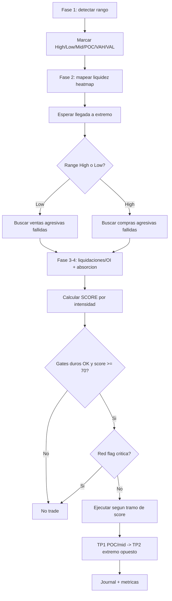

# Delta Range Reversal con Absorción — v3 (Unificado)

> **Documento de especificación para investigación, backtesting y paper trading.**
> No es recomendación financiera. Si esto salta a live sin validación walk-forward, el problema no será el algoritmo: será quien le dio permiso.

Esta versión funde tres cosas:
1. La **arquitectura por fases** del spec original (qué herramienta se usa y cuándo).
2. Un **motor de scoring por intensidad** (peso × intensidad continua) que reemplaza el sistema de votos.
3. **Todos los parámetros numéricos calibrados** — los `null` del documento original ahora tienen valores de partida razonados.
4. Aterrizaje concreto en **Flowsurface (tu fork)** y crypto perpetuos.

---

## 0. Qué cambió respecto al spec original

| Sección original | Cambio en v3 |
|---|---|
| Score de votos enteros (+2/+3, corte en 8) | Sustituido por `peso × intensidad` continuo (0–100), sección 23 |
| Parámetros en `null` (sección 26) | Calibrados con valores de partida, sección 26 |
| Umbrales absolutos implícitos | Todo normalizado contra SMA reciente, sección 2bis |
| Liquidaciones/OI como gate binario | Integrados al score con peso e intensidad, secciones 12 y 23 |
| Agnóstico de plataforma | Mapeado a paneles Flowsurface, sección 33 |

Todo lo demás (tesis, fases, setups long/short, red flags, gestión) se conserva porque ya estaba bien.

---

## 1. Tesis central (sin cambios)

```text
En un rango intradía, los extremos son zonas de decisión.
Si el precio llega a un extremo con volumen y delta agresivo,
pero no logra romper ni aceptar fuera del rango, ese flujo queda atrapado.
Luego se busca la rotación hacia POC / mid / VWAP o el extremo opuesto.

No operamos el medio. Operamos los extremos.
```

---

## 2. Mercado y timeframes

**Mercado base:** crypto perpetuos en Flowsurface (BTCUSDT PERP primario; ETH/SOL con recalibración propia).
**Por qué crypto:** Flowsurface solo conecta a exchanges crypto y te da liquidaciones, OI y heatmap DOM nativos — justo las señales que esta estrategia explota.

```text
Contexto:        M15 / M30
Rango operativo: M5 / M15
Ejecución:       M1 / M5
Footprint:       M1 / M5
Extra crypto:    Open Interest + liquidaciones + heatmap
```

Sesiones líquidas (UTC): London 07:00–10:00, NY 13:00–17:00. Evitar la "Dead zone" que tu propio layout ya marca entre cierre NY y apertura Asia.

---

## 2bis. Normalización — la regla que faltaba

**Ningún umbral es absoluto.** Todo se mide contra una media móvil reciente, así el sistema se auto-adapta a BTC tranquilo y a BTC en CPI. Ventana base `N = 50` velas (M5); para M1 usa `N = 150`.

Las cuatro variables maestras:

```text
VR  (Volume Ratio)   = volumen_vela / SMA(volumen, N)
DZ  (Delta Z-score)  = (delta_vela − media(delta, N)) / stdev(delta, N)
AS  (Absorption)     = ver 2bis.1
LI  (Liquidity Imb.) = (liq_resting_bid − liq_resting_ask) / (bid + ask)   # del heatmap/DOM
```

### 2bis.1 Absorption Score (la señal estrella en crypto)

```text
desplazamiento = (cierre − apertura) / rango_vela          # −1 a +1
AS_long  = max(−DZ, 0) × (1 − max(desplazamiento, 0))
AS_short = max( DZ, 0) × (1 − max(−desplazamiento, 0))
```

`AS_long` alto = mucha venta agresiva (DZ negativo) que **no logró** bajar el precio → vendedores atrapados → sesgo long. Esto es el corazón del setup en crypto, donde el agresor suele estar del lado equivocado.

### 2bis.2 Función de intensidad (usada por todo el score)

```text
intensidad(x, umbral_min, umbral_fuerte) =
    clamp( (x − umbral_min) / (umbral_fuerte − umbral_min), 0, 1 )
```

Una señal que apenas pasa el umbral aporta poco; una que lo supera con holgura aporta el peso completo. Esto es lo que el spec original no tenía.

---

## 3. Herramientas y momento de uso (tabla original, conservada)

| Herramienta | Fase | Función | ¿Dispara entrada? |
|---|---|---|---|
| Precio / velas | 1 | Detectar rango | No |
| Volume Profile / POC | 1 | Mid, POC, VAH/VAL, targets | No |
| Heatmap | 2 (pre-llegada) | Mapear liquidez oculta | No |
| Liquidaciones | 3 (al barrer extremo) | Confirmar limpieza (crypto) | No, sola no |
| Open Interest | 3 (barrida/post) | Cierre/entrada de posiciones | No |
| Footprint | 4 (en el extremo) | Ver absorción real | Sí, con trigger |
| Delta | 4 (en el extremo) | Medir agresión y fallo | Sí, con reclaim/flip |
| CVD | rango/extremo | Divergencia o ruptura | Filtro |
| Big Trades | 4 (en el extremo) | Grandes atrapados | Confirmación |
| Finish Action | 4 (en el extremo) | Drenaje de interés | Confluencia |
| VWAP/BWAP | 5 (gestión) | Target o filtro | No principal |

La secuencia temporal es lo que hace correcto este sistema: el heatmap se evalúa **antes** de llegar, el footprint **en** el extremo, el VWAP **después**. El score (sección 23) solo se calcula en Fase 4, cuando el precio ya está en zona.

---

## 4. Flujo general



---

## 5. Fase 1 — detección de rango (calibrado)

```yaml
range_detection:
  min_bars_inside_range: 20          # >=20 velas contenidas
  min_touches_total: 3
  min_touches_each_side: 1
  max_slope_midline: 0.15            # pendiente normalizada del mid; >0.15 = tendencia
  min_range_size_atr: 0.8            # rango debe medir >=0.8 ATR para pagar riesgo
  max_range_size_atr: 3.5            # >3.5 ATR ya no es rango operable intradia
  middle_zone_percentage: 0.35       # zona muerta = 35%-65% del rango

range_variables:
  range_high:  highest_swing_within_window
  range_low:   lowest_swing_within_window
  range_mid:   (range_high + range_low) / 2
  range_size:  range_high - range_low
  range_poc:   volume_profile_poc_inside_range
  range_vah:   value_area_high_inside_range
  range_val:   value_area_low_inside_range
```

Detección de régimen (rango vs tendencia), voto mayoritario de 3 señales:

```text
votos_tendencia = (value_area_se_desplaza)
                + (precio_sostenido_un_lado_de_VWAP)
                + (pendiente_CVD_fuerte)
regimen = TENDENCIA si votos_tendencia >= 2 else RANGO
```

Esta estrategia **solo opera en RANGO**. Si el régimen es tendencia, se queda quieta (o cede el turno a una estrategia de continuación, fuera del alcance de este doc).

---

## 6. Fase 2 — zonas operativas y zona muerta

Solo se opera en: Range High, Range Low, desviación/reclaim del extremo, cluster de liquidez cercano al extremo, POC absorbido en mecha.

```yaml
no_trade_zone:
  definition: price between 35% and 65% of range
  action: no_trade
```

---

## 7. Fase 3 — liquidaciones y Open Interest (crypto, ahora con score)

### Liquidaciones

```text
Long en Range Low:  precio pincha low -> liquidaciones de longs -> shorts tardios entran ->
                    si el precio reclama, esos shorts quedan atrapados.
Short en Range High: precio pincha high -> liquidaciones de shorts -> longs tardios entran ->
                    si vuelve dentro, esos longs quedan atrapados.
```

Umbral calibrado (liquidación significativa):

```yaml
liquidation_gate:
  liquidation_cluster_at_extreme: true
  liq_size_ratio = liq_usd_en_extremo / SMA(liq_usd, 50)
  liquidation_min_ratio: 3.0       # >=3x la media reciente de liquidaciones
  liquidation_strong_ratio: 8.0
```

### Open Interest

```yaml
open_interest_gate:
  oi_change_pct = (OI_actual - OI_hace_M_velas) / OI_hace_M_velas
  oi_lookback_bars: 6
  oi_drop_on_sweep_min: -0.015      # OI baja >=1.5% en la barrida = cierre forzado (bueno para fade)
  oi_rise_after_reclaim_min: 0.010  # OI sube >=1% tras reclaim con delta flip = nuevas posiciones a favor
```

### Regla dura (se conserva)

```text
Liquidaciones sin absorcion = NO trade.
Liquidaciones + absorcion + reclaim = setup valido.
```

---

## 8. Fase 4 — footprint, delta y absorción (núcleo)

### Absorción alcista en Range Low

```text
1. Precio llega o barre Range Low.
2. Entra delta negativo agresivo  (DZ <= -1.5).
3. Volumen incrementa            (VR >= 2.0).
4. La vela NO cierra con aceptacion bajo el rango.
5. POC de la vela en mecha baja  (poc_in_lower_wick).
6. Cierre vuelve dentro del rango.
7. Vela siguiente: delta flip positivo o reclaim.
```

### Absorción bajista en Range High

```text
1. Precio llega o barre Range High.
2. Entra delta positivo agresivo (DZ >= +1.5).
3. Volumen incrementa            (VR >= 2.0).
4. La vela NO cierra con aceptacion encima del rango.
5. POC de la vela en mecha alta  (poc_in_upper_wick).
6. Cierre vuelve dentro del rango.
7. Vela siguiente: delta flip negativo o reclaim bajista.
```

### Fórmula conceptual

```text
Agresion fuerte + falta de progreso  = absorcion (fade permitido).
Agresion fuerte + cierre fuera + aceptacion = ruptura real (NO fade).
```

---

## 9. Setup Long — Range Low Absorption (gates calibrados)

```yaml
setup_id: delta_range_reversal_long_absorption

context_gates:           # binarios, deben pasar TODOS
  market_regime: range
  valid_intraday_range: true
  price_location: range_low_zone
  not_in_middle_zone: true
  session_active: true
  spread_ok: spread < 2.0 * spread_mediano
  no_news_window: true              # +-10 min de evento macro

zone_gates:
  distance_to_low_atr: <= 0.25      # precio dentro de 0.25 ATR del low
  liquidity_zone_near_low: optional
  range_low_sweep: optional

orderflow_gates:         # alimentan el score, no son binarios
  delta_negative_expansion: DZ <= -1.5
  volume_expansion_at_low:  VR >= 2.0
  price_fails_to_accept_below_low: true
  close_back_inside_range: true

absorption_signals:      # cada una suma al score por intensidad
  - poc_in_lower_wick
  - absorption_score: AS_long >= 1.5
  - big_sell_trades_trapped: size_ratio >= 10
  - cvd_bullish_divergence
  - liquidation_cluster_at_low: liq_ratio >= 3.0

trigger_gates:           # al menos UNO requerido para ejecutar
  any_required:
    - delta_flip_positive: cambio de signo con abs(DZ) >= 1.5
    - reclaim_range_low
    - retest_absorbed_poc
    - bullish_engulfing_reclaim

red_flags:               # cualquiera cancela
  - strong_close_below_range_low
  - next_candle_accepts_below_range
  - delta_continues_negative_after_break
  - cvd_breaks_down_with_price
  - volume_expands_in_breakout_direction
  - no_reclaim_within: max_bars_for_reclaim (=3)
  - rr_below_minimum: min_rr (=1.5)

entry:
  aggressive:   retest_absorbed_poc
  conservative: close_confirmation_after_delta_flip
  alternative:  reclaim_range_low

stop:
  primary:   below_sweep_low - 0.25 * ATR
  secondary: below_absorption_low
  emergency: fixed_max_loss (= riesgo_pct de la cuenta)

targets:
  tp1: range_mid_or_poc
  tp2: range_high
  optional: [vwap, opposite_liquidity_pool]
```

El short (`delta_range_reversal_short_absorption`) es el espejo exacto: DZ >= +1.5, poc_in_upper_wick, AS_short, big_buy_trades_trapped, cvd_bearish_divergence, stop above_sweep_high.

---

## 10. Big Trades, CVD y Finish Action (confirmaciones)

**Big Trades válidos** (solo en extremos, dirección del intento fallido):
```text
Long:  big sell trades en Range Low, precio no baja, cierre dentro -> vendedores grandes atrapados.
Short: big buy trades en Range High, precio no sube, cierre dentro -> compradores grandes atrapados.
Umbral: size_ratio = print_size / SMA(print_size, 100) >= 10
```

**CVD — divergencias válidas (regla estricta de las transcripciones):**
```text
Alcista valida:  precio low igual/menor  +  CVD higher-low o plano.
Bajista valida:  precio high igual/mayor +  CVD lower-high o plano.
(Cualquier otra combinacion NO es divergencia valida y el sistema debe rechazarla.)
Lookback de swings: cvd_divergence_lookback = 20 velas.
```

**Finish Action** (drenaje de interés): el volumen se apaga en el extremo (VR cae por debajo de 0.7 tras un pico). Suma como confluencia, nunca como gatillo.

---

## 11. Absorción vs ruptura real (gate duro — la mejor pieza del sistema)

```yaml
breakout_real:           # si esto es true, se PROHIBE el fade
  true_if_all:
    - close_outside_range
    - next_candle_accepts_outside_range
    - volume_expansion_in_breakout_direction: VR >= 4.0
    - delta_expansion_in_breakout_direction:  abs(DZ) >= 2.0
    - cvd_confirms_breakout

fade_allowed:
  true_if:
    - breakout_real == false
    - absorption_detected == true
    - reclaim_detected == true
```

Si `breakout_real == true`, no hay trade aunque el score sea alto. Este gate va por encima de todo.

---

## 23. MOTOR DE SCORING (reemplaza los votos enteros)

El score se calcula **solo en Fase 4**, cuando el precio está en un extremo y los gates de contexto pasaron. Va de 0 a 100.

### 23.1 Pesos (esta estrategia opera solo en rango, así que una sola tabla)

| Señal | Variable | Peso | Umbral_min → Umbral_fuerte |
|---|---|---:|---|
| Proximidad al extremo | distance_to_extreme_atr | 18 | 0.25 → 0.05 (invertido: más cerca = más intensidad) |
| Absorción | AS_long / AS_short | 22 | 1.5 → 3.0 |
| POC en mecha | poc_wick_ratio | 12 | 0.5 → 0.9 |
| Delta shift / flip | abs(DZ) en la vela de flip | 12 | 1.5 → 2.5 |
| Volumen | VR | 10 | 2.0 → 4.0 |
| CVD divergencia | nº swings divergentes | 8 | 1 → 3 |
| Big trades atrapados | size_ratio | 6 | 10 → 25 |
| Liquidaciones (crypto) | liq_ratio | 6 | 3.0 → 8.0 |
| Open Interest confirma | abs(oi_change_pct) | 4 | 0.010 → 0.030 |
| Liquidez heatmap (LI) | abs(LI) cerca del nivel | 2 | 0.35 → 0.55 |
| **TOTAL posible** | | **100** | |

> Nota sobre proximidad: como "más cerca es mejor", la intensidad se calcula invertida:
> `intensidad_prox = clamp((0.25 − dist_atr) / (0.25 − 0.05), 0, 1)`.

### 23.2 Cálculo

```text
score = Σ  peso(señal) × intensidad(señal)

donde intensidad(señal) = clamp((valor − u_min)/(u_fuerte − u_min), 0, 1)
```

### 23.3 Ejemplo (long en Range Low de BTC, M5)

| Señal | Valor | Intensidad | Aporte |
|---|---|---:|---:|
| Proximidad | 0.08 ATR | 0.85 | 18 × 0.85 = 15.3 |
| Absorción | AS_long 2.4 | 0.60 | 22 × 0.60 = 13.2 |
| POC en mecha | ratio 0.82 | 0.80 | 12 × 0.80 = 9.6 |
| Delta flip | DZ 2.1 | 0.60 | 12 × 0.60 = 7.2 |
| Volumen | VR 3.1 | 0.55 | 10 × 0.55 = 5.5 |
| CVD diverg. | 2 swings | 0.50 | 8 × 0.50 = 4.0 |
| Big trades | 12× | 0.13 | 6 × 0.13 = 0.8 |
| Liquidaciones | 5× | 0.40 | 6 × 0.40 = 2.4 |
| OI confirma | 1.8% | 0.40 | 4 × 0.40 = 1.6 |
| LI heatmap | 0.42 | 0.35 | 2 × 0.35 = 0.7 |
| **SCORE** | | | **60.3** |

### 23.4 Tramos de decisión y tamaño

| Score | Acción | Tamaño |
|---|---|---|
| < 55 | No trade | — |
| 55 – 69 | Scout | 0.5× base |
| 70 – 84 | Estándar | 1.0× base |
| ≥ 85 | Alta convicción | 1.5× base (tope) |

El ejemplo (60.3) sería un **scout a 0.5×**. Para llegar a estándar necesitaría, por ejemplo, mayor absorción o estar más pegado al extremo.

### 23.5 Override de red flag (se conserva del original)

```yaml
quality_score:
  min_score_to_trade: 55
  critical_red_flag_override: true   # red flag critica = no trade aunque score >= 85
```

---

## 24. Gestión del trade (calibrada)

```yaml
trade_management:
  min_rr_to_tp1: 1.0
  min_rr_to_tp2: 1.5
  min_rr_overall: 1.5               # gate duro: si no hay 1.5R hasta TP2, no se entra
  partial_at_tp1: 0.5               # cerrar 50% en POC/mid
  move_stop_to_breakeven_after_tp1: true
  partial_at_tp2: 0.3
  trailing_remainder: true          # 20% restante con trailing por delta/CVD

trailing_logic:
  one_time_framing: true            # SL bajo el min de las ultimas 3 velas (long)
  exit_if_delta_reverses_strong: true
  exit_if_no_new_extreme_in_bars: 3
  exit_if_opposite_big_trade_at_zone: true

session_discipline:
  max_trades_per_session: 3
  reduce_size_after_win: true
  stop_after_consecutive_losses: 2
  daily_target_pct: 1.0
  daily_stop_pct: 0.6
  risk_pct_per_trade: 1.0
```

---

## 25. Red flags críticas (se conservan)

```yaml
critical_red_flags:
  - strong_close_outside_range
  - acceptance_outside_range
  - delta_continuation_breakout
  - cvd_breakout_confirmation
  - volume_expansion_breakout
  - no_reclaim
  - middle_zone
  - rr_below_minimum
  - high_impact_news_window
```

---

## 26. Parámetros — TODOS calibrados (antes en null)

```yaml
calibrated_parameters:        # punto de partida BTCUSDT PERP M5; recalibrar por activo
  # estructura de rango
  range_window_bars: 20
  min_range_touches: 3
  extreme_tolerance_atr: 0.25
  min_range_size_atr: 0.8
  max_range_size_atr: 3.5
  middle_zone_pct: 0.35
  # normalizacion
  sma_window: 50              # 150 para M1
  # order flow
  volume_expansion_vr: 2.0
  volume_breakout_vr: 4.0
  delta_expansion_dz: 1.5
  delta_breakout_dz: 2.0
  absorption_min: 1.5
  absorption_strong: 3.0
  poc_wick_min: 0.5
  stacked_imbalance_ratio: 3.0   # 300% (consenso de las transcripciones)
  stacked_imbalance_levels: 3
  # confirmaciones
  big_trade_size_ratio: 10.0
  liquidation_min_ratio: 3.0
  oi_change_threshold: 0.010
  oi_lookback_bars: 6
  cvd_divergence_lookback: 20
  liquidity_imbalance_li: 0.35
  # ejecucion / gestion
  acceptance_bars_outside_range: 2
  max_bars_for_reclaim: 3
  min_rr: 1.5
  vwap_dead_zone_atr: 0.15
  spread_max_mult: 2.0
  news_buffer_min: 10
  # decision
  score_scout: 55
  score_standard: 70
  score_high_conviction: 85
```

---

## 27. Backtesting (debe incluir)

Comisiones, slippage, spread, horario de sesión, ventanas de noticias, liquidez por activo, datos reales de footprint, liquidaciones+OI solo donde existan, separación long/short.

Métricas objetivo: win rate 45–55%, profit factor > 1.3, RR realizado ≥ 1.5, max drawdown < 10%, expectancy positiva. Mínimo 200–300 trades por configuración. **Walk-forward obligatorio** (entrena 2 meses, valida 1, avanza). Si los pesos óptimos saltan salvajemente entre ventanas → estás sobreajustando, simplifica.

---

## 28. Journal automático (cada trade guarda)

```yaml
journal_fields:
  timestamp, market, session, setup_id, side, regime
  range_high, range_low, range_poc
  entry_price, stop_price, tp1, tp2
  score_total, score_breakdown       # NUEVO: desglose por señal
  vr_at_entry, dz_at_entry, as_at_entry
  cvd_state, big_trade_present, liquidation_ratio, oi_state
  entry_mode, exit_reason, result_R
  screenshot_path
```

El `score_breakdown` es nuevo y clave: te deja correlacionar qué señales realmente predicen ganancias. Con eso recalibras los pesos con datos, no con intuición.

---

## 29. Pseudocódigo (con score inyectado)

```python
def detect_delta_range_reversal(market, cfg):
    rng = detect_intraday_range(market, cfg)
    if not rng.valid or detect_regime(market) != "RANGE":
        return None
    if price_in_middle_zone(market.price, rng):
        return None

    for side, near_extreme, absb, breakout in [
        ("long",  near_range_low,  detect_sell_absorption_at_low,  detect_real_breakout_down),
        ("short", near_range_high, detect_buy_absorption_at_high, detect_real_breakout_up),
    ]:
        if not near_extreme(market.price, rng):
            continue
        if breakout(market, rng):          # gate duro absorcion vs ruptura
            return None
        if not absb(market, rng):
            continue

        trigger = has_trigger(market, rng, side)        # flip / reclaim / retest
        if not trigger:
            continue

        score, breakdown = compute_score(market, rng, side, cfg)   # 0-100, seccion 23
        if score < cfg.score_scout or has_critical_red_flag(market, rng, side):
            return None
        if not risk_reward_valid(market, rng, side, cfg.min_rr):
            return None

        size_mult = size_from_score(score, cfg)          # 0.5 / 1.0 / 1.5
        return build_order(side, market, rng, score, breakdown, size_mult)

    return None
```

---

## 33. Mapeo a Flowsurface (tu fork)

| Necesidad del sistema | Panel Flowsurface | Qué construir encima |
|---|---|---|
| VR, DZ, AS, POC, stacked imbalance | Footprint | Módulo de features que calcula las 4 variables maestras por vela |
| LI, muros, big trades, absorción contra liquidez | Heatmap (DOM histórico) | Clasificador de big trades por size_ratio + flag de "atrapado" |
| Estructura, rango, ATR | Candlestick | Detector de rango + régimen |
| Desequilibrio L2 en vivo, pace | DOM/Ladder + Time&Sales | Pace de absorción en tiempo real |
| Liquidaciones + OI | (nuevo, vía API exchange) | Stream de liquidaciones y OI, no nativo en Flowsurface base |

### Paneles nuevos a construir (prioridad)

1. **Score HUD en vivo** — score 0–100 + desglose por señal + estado de gates + régimen. Sin esto, automatizar es operar a ciegas.
2. **CVD con detección de divergencias** — línea de CVD + marcado de divergencias válidas según la regla estricta.
3. **Mapa de zonas persistentes** — Range High/Low/Mid/POC/VAH/VAL + VWAP + Rastro, coloreadas por frescura.
4. **Panel de liquidaciones + OI** — clusters en extremos + cambio de OI (requiere stream extra del exchange).
5. **Delta candles** — vista donde el cuerpo es el delta y la mecha la absorción.
6. **Panel de trade activo** — TP1/2/3, SL, R en vivo, alertas de invalidación.

### Config en caliente

Toda la sección 26 vive en un `config.toml` recargable sin recompilar. Iteras la calibración mirando el Score HUD en paper trading.

---

## Resumen ejecutivo

- **Una estrategia, una tesis:** fade de extremos de rango con absorción. No opera el medio, no opera tendencia.
- **Score continuo, no votos:** `peso × intensidad`, corte en 55/70/85, tamaño escalado por convicción.
- **Todo normalizado:** VR, DZ, AS, LI contra SMA(50). Nada absoluto.
- **Gate duro absorción vs ruptura** por encima del score.
- **Crypto-nativo:** liquidaciones + OI integrados al score.
- **Números calibrados** como punto de partida; recalibra con walk-forward antes de creer cualquiera.
- **Aterrizado en Flowsurface** con 6 paneles y config TOML en caliente.
