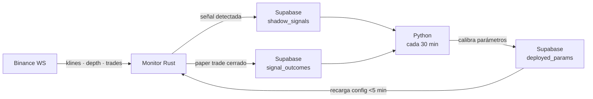

# FlowSurface — Wiki

Documentación técnica completa del sistema. Capa por capa, desde la infraestructura hasta la calibración.

---

## Índice

### Arquitectura
- [Arquitectura del sistema](architecture.md) — cómo conectan todos los componentes

### Referencia técnica
- [Monitor Rust](reference/monitor.md) — main loop, bar state, streams, métricas
- [Estrategias](reference/strategy.md) — router, scorer, paper trading, tracker, logger
- [Datos Institucionales](reference/institutional.md) — 4 trackers, L/S ratio, liquidaciones, OI, funding
- [Data Crate](reference/data-crate.md) — persistencia, layout, chart data, agregación, panel data
- [Exchange Crate](reference/exchange.md) — Ticker, Kline, Depth, 5 exchanges, adapter, depth sync
- [Frontend Desktop](reference/frontend.md) — Iced 0.14, pane types, heatmap WGPU, connector, strategy
- [Supabase](reference/supabase.md) — tablas, vista, RLS, queries útiles
- [Pipeline de calibración](reference/calibration.md) — walk-forward, DSR, Kelly, degradation monitor

### Guías operacionales
- [Correr en local](guides/run-local.md) — MinGW, run.bat, variables de entorno
- [Deploy en Railway](guides/deploy.md) — variables, redeploy, ver logs
- [Correr calibración](guides/calibration-run.md) — monitor.py, interpretar resultados, MLflow

### Detectores
- [LiquidationHunt](strategies/liquidation-hunt.md)
- [SmartMoneyDivergence](strategies/smart-money-divergence.md)
- [FundingExhaustionReversal](strategies/funding-exhaustion.md)
- [VwapValuePullbackContinuation](strategies/vwap-pullback.md)
- [ValueAreaFailedAuction](strategies/value-area-auction.md)
- [LvnLiquidityVacuumBreakout](strategies/lvn-breakout.md)

---

## Stack

| Capa | Tecnología | Propósito |
|------|-----------|-----------|
| Stream | Binance LinearPerps WebSocket | Klines, depth, trades en tiempo real |
| Monitor | Rust (Railway) | Detección de señales, paper trading |
| Storage | Supabase (PostgreSQL) | Señales, trades, snapshots, configuración |
| Calibración | Python (local) | Walk-forward, optimización, deploy de params |
| Tracking | MLflow | Historial de calibraciones |

## Flujo resumido

