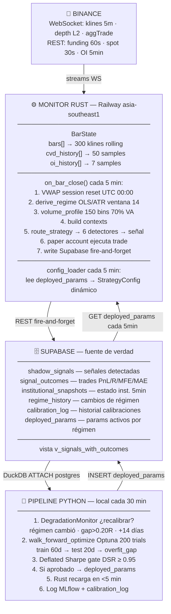
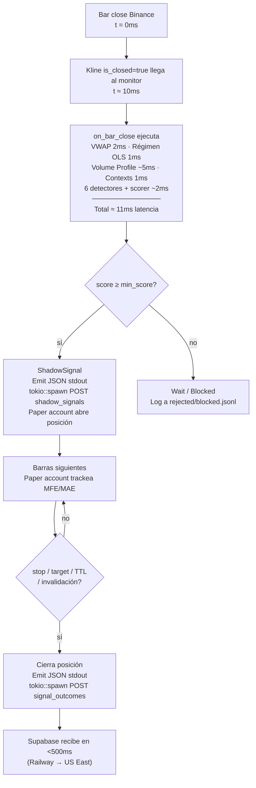
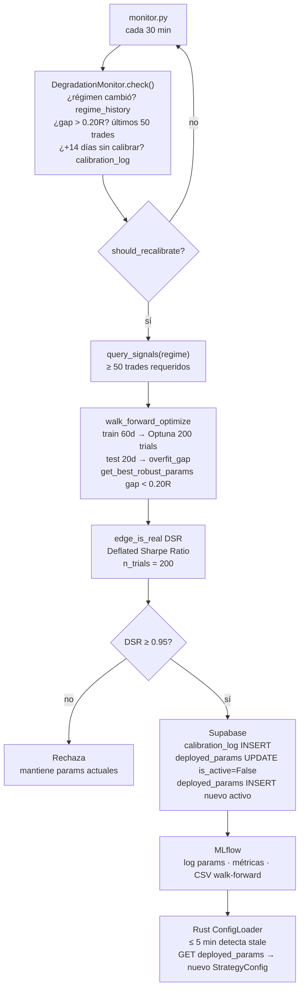
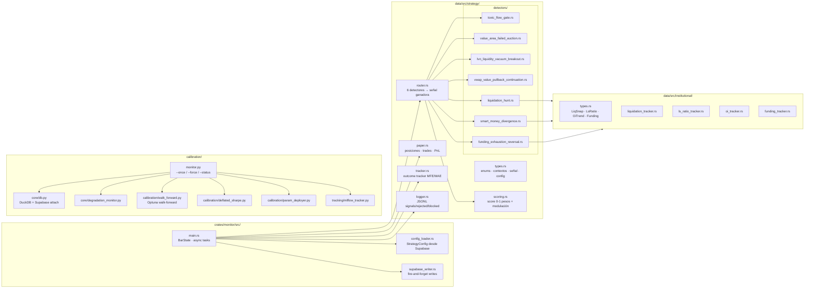

# Arquitectura del sistema

## Visión general

FlowSurface es un sistema de detección de señales institucionales en crypto. Corre 24/7 en Railway, monitorea BTC perpetual en Binance, detecta setups de trading mediante 6 detectores, y se recalibra automáticamente cuando el mercado cambia.



---

## Capas del sistema

### Capa 1 — Datos en tiempo real (Binance)

**WebSocket streams** (via `exchange` crate, adaptador Binance):
| Stream | Frecuencia | Uso |
|--------|-----------|-----|
| Kline LinearPerps | Cada tick + cierre de barra | OHLCV, bar close trigger |
| Depth L2 | Cada actualización | OBI, spread, walls, microprice |
| AggTrade | Cada trade | CVD, delta, taker imbalance |

**REST fetches** (async tasks independientes):
| Endpoint | Intervalo | Uso |
|----------|----------|-----|
| `fapi/v1/premiumIndex` | 60s | Funding rate, mark price |
| `api/v3/ticker/price` | 30s | Spot price para basis |
| `fapi/v1/openInterest` | 5 min | OI para momentum y delta |

### Capa 2 — Procesamiento de señales (Rust)

Ver [reference/monitor.md](reference/monitor.md) para detalle del bar state y el pipeline de señales.

Ver [reference/strategy.md](reference/strategy.md) para router, scorer, detectores y paper account.

### Capa 3 — Persistencia (Supabase)

Ver [reference/supabase.md](reference/supabase.md) para el schema completo y queries útiles.

### Capa 4 — Calibración (Python)

Ver [reference/calibration.md](reference/calibration.md) para el pipeline completo.

---

## Flujo de una señal: de Binance a Supabase



---

## Flujo de recalibración: de datos a nuevos parámetros



---

## Componentes y archivos



---

## Régimen de mercado

El sistema no opera igual en todos los regímenes. El régimen se calcula en cada bar close:

```rust
fn derive_regime(closes: &[f64], atr: f64) -> Regime {
    let slope = ols_slope(closes) / atr;  // pendiente normalizada por ATR
    
    match slope {
        s if s >  0.3  => Regime::TrendUp
        s if s < -0.3  => Regime::TrendDown
        s if s.abs() < 0.1 => Regime::Chop
        // + Compression, Expansion, Stress, Aftermath via volatility
    }
}
```

**Impacto en detección:**
| Régimen | Detectores activos preferentemente | Score modifier |
|---------|----------------------------------|----------------|
| TrendUp | VwapPullback (long), LvnBreakout (long) | ×1.15 si alineado |
| TrendDown | VwapPullback (short), ValueArea (short) | ×1.15 si alineado |
| Chop | FundingExhaustion, SmartMoney, ValueArea | ×0.70 para trend-following |
| Expansion | LiquidationHunt, LvnBreakout | ×1.15 si alineado |
| Stress/Aftermath | Todos bloqueados o reducidos | múltiples gates activos |

**Impacto en calibración:**  
Los parámetros en `deployed_params` se guardan **por régimen** — el sistema tiene parámetros distintos para TrendUp vs. Chop vs. Expansion. Cuando el régimen cambia, carga los params calibrados para ese contexto.
