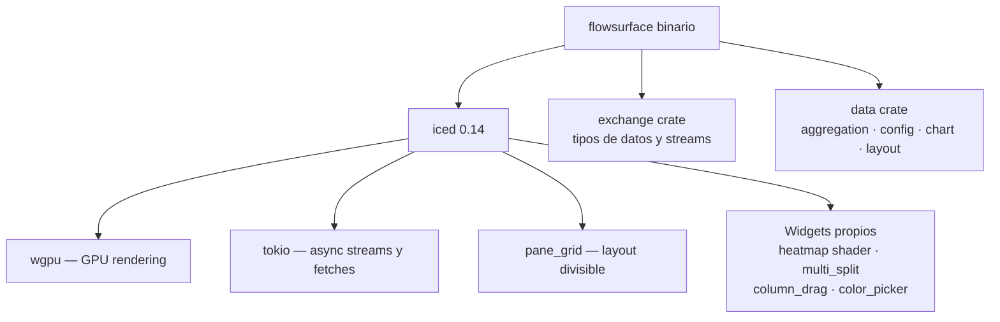

# Referencia: Frontend Desktop (Iced)

Crate raíz: `src/` — binario principal `flowsurface`

App de escritorio construida con [Iced](https://github.com/iced-rs/iced) 0.14 + wgpu. Soporta múltiples ventanas, pane grid redimensionable, charts de canvas y un renderer de heatmap con shaders WGPU propios.

---

## Stack técnico



---

## Estructura del binario (`src/`)

```
main.rs                 ← iced::daemon, struct Flowsurface, subscriptions
screen/
  dashboard.rs          ← PaneGrid principal, despacha mensajes a panes
  dashboard/
    pane.rs             ← contenido de cada pane (chart / panel / monitor)
    panel/
      ladder.rs         ← Order Ladder (libro de órdenes nivel 2 visual)
      timeandsales.rs   ← Time & Sales (tape de trades en tiempo real)
    sidebar.rs          ← sidebar de tickers y navegación
    tickers_table.rs    ← tabla de tickers con stats 24h

chart.rs                ← trait Chart + tipos compartidos
chart/
  kline.rs              ← Chart de velas japonesas (canvas iced)
  heatmap.rs            ← Chart de liquidez en tiempo real
  comparison.rs         ← Chart de comparación multi-ticker
  indicator.rs          ← sistema de indicadores
  indicator/kline/      ← indicadores por vela: VWAP, VP, CVD, OI, ATR, Volume...
  indicator/plot/       ← renderers de línea y barra para los indicadores
  scale/
    linear.rs           ← escala de precio (eje Y)
    timeseries.rs       ← escala de tiempo (eje X)

widget/
  chart/heatmap/        ← widget WGPU del heatmap (shader propio)
  multi_split.rs        ← splitter redimensionable (usado en panels)
  column_drag.rs        ← columnas arrastrables (tickers table)
  color_picker.rs       ← selector de color para el theme editor
  toast.rs              ← notificaciones temporales

modal/
  pane.rs               ← modales de configuración por pane
  pane/settings.rs      ← settings de chart: indicadores, timeframe, ticker
  pane/indicators.rs    ← toggle de indicadores individuales
  pane/stream.rs        ← configuración de streams
  audio.rs              ← player de audio (alerts sonoras)
  layout_manager.rs     ← guardar/cargar layouts
  network_manager.rs    ← proxy, configuración de red
  theme_editor.rs       ← editor de tema visual

connector/
  stream.rs             ← gestiona subscripciones a streams de exchange
  fetcher.rs            ← gestiona fetches REST (klines históricas, OI, trades)

strategy/               ← copia del sistema de detección para el frontend
  types.rs, router.rs, scoring.rs, paper.rs, tracker.rs, logger.rs, adapter.rs
  detectors/            ← 3 detectores (subset del monitor): ValueArea, LvnBreakout, VwapPullback
  context.rs, snapshot.rs, intent_logger.rs

audio.rs                ← rodio: reproducción de .wav
layout.rs               ← LayoutId, gestión de múltiples layouts
logger.rs               ← fern: setup de logging a archivo
notify.rs               ← sistema de notificaciones de app
style.rs                ← colores, fuentes, iconos (AzeretMono, fontello icons)
version.rs              ← versión del binario
window.rs               ← gestión de múltiples ventanas iced
```

---

## Modelo de la aplicación

```rust
struct Flowsurface {
    main_window: window::Window,
    sidebar: dashboard::Sidebar,
    handles: exchange::adapter::AdapterHandles,  // conexiones activas a exchanges
    layout_manager: LayoutManager,               // layouts guardados
    theme_editor: ThemeEditor,
    network: NetworkManager,                     // proxy, timeouts
    audio_stream: AudioStream,
    confirm_dialog: Option<ConfirmDialog<Message>>,
    volume_size_unit: exchange::SizeUnit,        // Base o Quote
    ui_scale_factor: data::ScaleFactor,
    timezone: data::UserTimezone,
    theme: data::Theme,
    notifications: Notifications,
}
```

El patrón es el estándar de Iced: `update(message) → Task`, `view() → Element`, `subscription() → Subscription`.

---

## Tipos de pane (`ContentKind`)

Cada celda del pane grid puede contener uno de:

| Tipo | Descripción |
|------|-------------|
| `Kline` | Chart de velas con indicadores overlay y subplots |
| `Heatmap` | Liquidity heatmap en tiempo real (WGPU shader) |
| `Comparison` | Chart de comparación de precio entre múltiples tickers |
| `Ladder` | Order Ladder — orderbook L2 visual con trades |
| `TimeAndSales` | Tape de trades en tiempo real con filtros de tamaño |
| `TickersTable` | Tabla de tickers con estadísticas 24h |
| `StrategyMonitor` | Pane de monitoreo del paper trading (señales, PnL) |

---

## Sistema de indicadores

### KlineIndicator (sobre el chart de velas)

Indicadores disponibles en el kline chart:

| Indicador | Archivo | Descripción |
|-----------|---------|-------------|
| `Vwap` | `indicator/kline/vwap.rs` | VWAP de sesión + bandas ±1σ/±2σ |
| `VolumeProfile` | `indicator/kline/volume_profile.rs` | POC/VAH/VAL/HVN/LVN como overlay |
| `CumulativeDelta` | `indicator/kline/cumulative_delta.rs` | CVD como subplot |
| `OiDelta` | `indicator/kline/oi_delta.rs` | OI delta barra a barra (verde/rojo) |
| `OpenInterest` | `indicator/kline/open_interest.rs` | OI absoluto como subplot |
| `Volume` | `indicator/kline/volume.rs` | Volumen con separación buy/sell |
| `RelativeVolume` | `indicator/kline/relative_volume.rs` | Volumen relativo al promedio |
| `Atr` | `indicator/kline/atr.rs` | Average True Range subplot |

### HeatmapIndicator

Estudios visuales sobre el heatmap: densidad de liquidez, trades grandes, etc.

### Plot renderers (`indicator/plot/`)

- `bar.rs` — barras verticales (volume, OI delta)
- `line.rs` — líneas continuas (CVD, OI, ATR)

---

## Heatmap WGPU (`widget/chart/heatmap/`)

El heatmap es el componente más complejo — renderiza el orderbook L2 como un mapa de calor en tiempo real usando shaders WGPU propios.

```
heatmap/
  widget.rs     ← widget Iced que envuelve el renderer WGPU
  instance.rs   ← estado de una instancia del heatmap
  view.rs       ← lógica de vista y zoom
  scene/
    camera.rs   ← cámara (viewport, zoom, pan)
    cell.rs     ← celda individual del heatmap
    depth_grid.rs ← grid del orderbook
    pipeline.rs   ← pipelines WGPU
    pipeline/
      circle.rs   ← pipeline para trades (círculos proporcionales al tamaño)
      rectangle.rs ← pipeline para celdas del orderbook
    uniform.rs  ← uniform buffers para shaders
  ui/
    axisx.rs    ← eje X (tiempo)
    axisy.rs    ← eje Y (precio)
    overlay.rs  ← overlay de información (crosshair, tooltip)
```

El heatmap usa `PushFrequency::Custom(Timeframe)` para controlar cada cuánto recibe updates del orderbook (100ms–1000ms).

---

## Connector (`src/connector/`)

### `stream.rs` — gestión de suscripciones

Mantiene la lista de `StreamConfig` activos. Cuando un pane abre/cierra, actualiza las suscripciones via `AdapterHandles`. Límites:
- `MAX_KLINE_STREAMS_PER_STREAM` — máx streams de klines por conexión WebSocket
- `MAX_TRADE_TICKERS_PER_STREAM` — máx tickers de trades por conexión

### `fetcher.rs` — fetches REST

Maneja requests de datos históricos:
- `FetchSpec` — qué fetch hacer (klines, OI, trades, depth snapshot, ticker info)
- `FetchRange` — rango de tiempo a fetch
- `FetchedData` — datos recibidos, distribuidos al pane que los pidió
- `InfoKind` — tipo de info que el pane está esperando (mostrado en `Status::Loading`)

Los fetches se despachan como `Task` de Iced y se completan de forma async. Cuando llegan, `Dashboard::DistributeFetchedData` los envía al pane correcto.

---

## Strategy en el frontend (`src/strategy/`)

El frontend tiene su propia copia del sistema de detección — independiente del monitor headless de Railway. Corre en el proceso del desktop, opera sobre los datos que el usuario tiene abiertos en ese momento.

Diferencias con `data/src/strategy/` (el usado por el monitor):
- Solo 3 detectores (ValueArea, LvnBreakout, VwapPullback) — los institucionales requieren datos que el monitor REST fetches pero el frontend no tiene
- Añade `src/strategy/context.rs` — builder de contexto desde los datos del chart activo
- Añade `src/strategy/snapshot.rs` — snapshot del estado para el pane StrategyMonitor
- Añade `src/strategy/intent_logger.rs` — logger de intents para análisis local

---

## Key Levels y Session Lines

### Key Levels (`chart/kline.rs`)

Niveles de precio automáticos dibujados en el chart:
- **PDH/PDL** — Previous Day High/Low
- **DO** — Daily Open
- **WO** — Weekly Open

Con tooltip hover que muestra el nombre del nivel.

### Session Lines

Rectángulos pasteles que marcan cada sesión de trading (Asia, Europa, América). Configurables en el modal de settings del pane.

---

## Persistencia de configuración

La configuración del usuario se guarda en disco via el `data` crate:
- **Layout**: qué panes están abiertos, qué ticker/timeframe tiene cada uno, posición en el pane grid
- **Theme**: colores personalizados del usuario
- **Config**: proxy, timezone, scale factor, volume unit

Al arrancar, `data::cleanup_old_market_data` limpia datos de mercado cacheados en disco que ya son obsoletos.

---

## Fonts y assets

| Asset | Descripción |
|-------|-------------|
| `AzeretMono-Regular.ttf` | Fuente monospace usada en toda la UI |
| `icons.ttf` | Iconos via fontello (flechas, settings, close, etc.) |
| `*.wav` | Alertas sonoras para notificaciones (dry-pop-up, fall-on-foam, typewriter) |

---

## Workspace Cargo.toml

```toml
[workspace]
members = ["data", "exchange", "crates/monitor"]

[workspace.package]
version = "0.8.8"
edition = "2024"

[workspace.dependencies]
iced_core = "0.14.0"
chrono = "0.4.40"
serde = "1.0.219"
serde_json = "1.0.140"
# ... (data y exchange como workspace deps)
```

El binario principal (`flowsurface`) usa iced con features: `wgpu`, `tokio`, `canvas`, `sipper`, `advanced`, `unconditional-rendering`, `crisp`.

Feature `debug` = `iced/hot` (hot reload en desarrollo).
