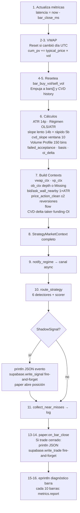

# Referencia: Monitor Rust

Archivo principal: `crates/monitor/src/main.rs`

---

## Propósito

Proceso headless que corre en Railway. Conecta a Binance LinearPerps via WebSocket, acumula estado de barra, ejecuta los detectores en cada cierre de barra, y persiste señales y trades en Supabase.

---

## Constantes

```rust
VP_WINDOW    = 300   // barras en el rolling window de Volume Profile (~41h a 5m)
VP_BINS      = 150   // bins de precio para el histograma
REGIME_WINDOW = 14   // barras para la pendiente OLS del régimen
CVD_WINDOW   = 50    // historial de CVD para calcular slope
ATR_WINDOW   = 14    // período del ATR
```

---

## Variables de entorno

| Variable | Default | Descripción |
|----------|---------|-------------|
| `SYMBOL` | `BTCUSDT` | Par a monitorear |
| `TIMEFRAME_MIN` | `5` | Timeframe en minutos (1/3/5/15/30/60) |
| `SUPABASE_URL` | — | URL del proyecto Supabase |
| `SUPABASE_KEY` | — | service_role key (bypasea RLS) |
| `PAPER_INITIAL_CAPITAL` | `3000.0` | Capital inicial en USD |
| `PAPER_LEVERAGE` | `1.0` | Leverage (1 = sin apalancamiento) |
| `PAPER_MAX_POSITIONS` | `1` | Máximo de posiciones simultáneas |
| `PAPER_RISK_PCT` | `0.01` | Riesgo por trade (1% del equity) |
| `PAPER_SLIPPAGE_BPS` | `1.0` | Slippage en basis points por lado |
| `PAPER_TAKER_FEE` | `0.0004` | Fee taker Binance (0.04%) |
| `PAPER_FUNDING_RATE` | `0.0001` | Funding rate asumido (0.01% / 8h) |

---

## BarState

Struct que centraliza todo el estado del monitor:

```rust
struct BarState {
    // Rolling windows
    bars: VecDeque<Kline>,        // últimas VP_WINDOW barras
    cvd_history: VecDeque<f64>,   // CVD acumulado por barra
    oi_history: VecDeque<f64>,    // OI en contratos por fetch

    // Intrabar accumulators (reset en cada cierre)
    cvd: f64,
    bar_buy_vol: f64,
    bar_sell_vol: f64,

    // VWAP session
    vwap_cum_pv: f64,   // sum(price × vol)
    vwap_cum_vol: f64,  // sum(vol)
    vwap_day: i64,      // día UTC actual (para reset)
    vwap_session: Option<f64>,

    // Context periódico
    depth: Option<Depth>,
    funding_rate: Option<f64>,
    spot_price: Option<f64>,

    // Components
    paper: PaperAccount,
    metrics: PipelineMetrics,
    cfg: StrategyConfig,           // recargado dinámicamente desde Supabase
    config_loader: ConfigLoader,
    supabase: Option<SupabaseWriter>,
    regime_tx: Option<Sender<String>>,  // canal para trigger de config reload
}
```

---

## Pipeline de cierre de barra

`on_bar_close(bar, bar_close_ms, symbol)` — ejecuta en cada cierre:



---

## Volume Profile

Algoritmo propio de 150 bins:

```rust
fn compute_volume_profile(bars, n_bins=150, current_price) 
    → (poc, vah, val, hvn_nearby, lvn_nearby)
```

1. Calcula rango de precio (max_high - min_low) de todas las barras
2. Divide en 150 bins de igual tamaño
3. Para cada barra: distribuye volumen proporcionalmente entre bins que cubre (low→high)
4. POC = bin con máximo volumen acumulado
5. Value Area = expande desde POC hasta cubrir 70% del volumen total
6. HVN/LVN: dentro del 5% del precio actual, bins con >2× o <0.3× el volumen promedio

---

## Cálculo de régimen

```rust
fn compute_ols_slope(closes: &[f64], atr: f64) -> f64 {
    // Pendiente OLS (regresión lineal simple) normalizada por ATR
    // Resultado: unidades de ATR por barra
    // > 0.3 = tendencia alcista fuerte
    // < -0.3 = tendencia bajista fuerte
    // ±0.1 = chop
}

fn derive_regime(closes, atr) -> Regime {
    // Usa slow_slope (14 barras) y fast_slope (5 barras)
    // para determinar TrendUp/Down/Chop/Compression/Expansion
}
```

---

## Tasks async periódicos

Todos corren como `tokio::spawn` independientes, comunican via `mpsc::channel`:

| Task | Intervalo | Canal | Dato |
|------|----------|-------|------|
| `fetch_premium_index` | 60s | `funding_rx` | `(Option<f64>, Option<f64>)` = (funding, mark_price) |
| `fetch_spot_price` | 30s | `spot_rx` | `Option<f64>` = spot price |
| `fetch_open_interest` | 300s | `oi_rx` | `Option<f64>` = OI en contratos |
| `regime_rx` | por evento | `regime_rx` | `String` = régimen actual → trigger config reload |

---

## config_loader.rs

```rust
pub struct ConfigLoader {
    supabase_url: Option<String>,
    supabase_key: Option<String>,
    client: reqwest::Client,
    pub current_regime: String,
    pub last_reload: Option<Instant>,
}
```

**Lógica de reload:**
- `should_reload(new_regime)` → true si régimen cambió O han pasado ≥5 min
- `load_for_regime(regime)` → GET `/rest/v1/deployed_params?regime=eq.{regime}&strategy=is.null&is_active=eq.true&order=updated_at.desc&limit=1`
- Si no hay fila: retorna `StrategyConfig { enabled: true, ..default() }`
- Si Supabase falla: retorna el default sin crashear

**Parse de JSON a StrategyConfig:**
```rust
fn parse_config_from_json(params: &Value) -> StrategyConfig {
    // Cada campo tiene fallback al default si falta en el JSON
    // Permite deploys parciales (solo algunos campos actualizados)
}
```

---

## supabase_writer.rs

```rust
pub struct SupabaseWriter {
    url: String,
    key: String,
    client: reqwest::Client,
}
```

**write_signal(signal, ctx):**
- Solo escribe si `action != Wait`
- Mapea `StrategyMarketContext` → JSON row para `shadow_signals`
- Campos institucionales solo si `ctx.institutional.is_some()`
- Fire-and-forget: `tokio::spawn(async { writer.post("shadow_signals", body).await })`

**write_trade(trade):**
- Calcula `r_multiple` = (exit - entry) × side / |entry - stop|
- Calcula `duration_ms`, `mfe_r`, `mae_r`
- Fire-and-forget: `tokio::spawn(async { writer.post("signal_outcomes", body).await })`

**post(table, body):**
- Headers: `apikey`, `Authorization: Bearer`, `Prefer: return=minimal`
- Errores logueados a stderr, nunca crash

---

## PipelineMetrics

```rust
struct PipelineMetrics {
    kline_ticks: u64,
    trade_batches: u64,
    trade_count: u64,
    depth_updates: u64,
    bars_processed: u64,
    latencies_ms: Vec<i64>,
    last_depth_at: Option<Instant>,
    last_trade_at: Option<Instant>,
}
```

**report()** (cada 10 barras):
- Promedio y máximo de latencia
- Edad del último depth y trade update
- Warnings si depth_age > 5s o trade_age > 5s o avg_latency > 500ms

---

## Outputs del monitor

**stdout** (capturado por Railway logs):
```json
{"event":"signal","data":{...StrategySignal JSON...}}
{"event":"trade_closed","data":{...ClosedTrade JSON...}}
{"event":"near_miss","data":{...NearMiss JSON...}}
```

**stderr** (diagnóstico):
```
[bar] ts=1234567890000 close=95420.50 regime=TrendUp slow=0.312 fast=0.421 ...
[metrics] bars=100 latency_avg=12ms max=45ms depth_age=1200ms ...
[config] Loaded calibrated params for regime 'TrendUp': min_score=0.68 ...
[supabase] POST shadow_signals error 422: {...}
```

**JSONL local** (`data/logs/`):
- `strategy_signals.jsonl` — señales emitidas
- `strategy_rejected.jsonl` — rechazadas por score bajo
- `strategy_blocked.jsonl` — bloqueadas por gates
- `strategy_outcomes.jsonl` — outcomes del tracker en memoria
