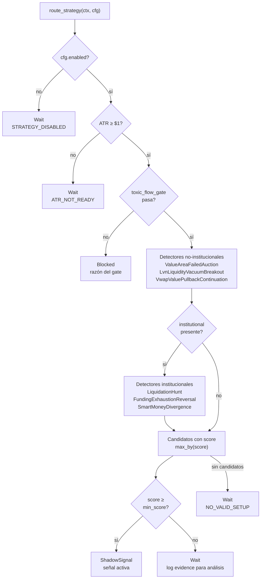
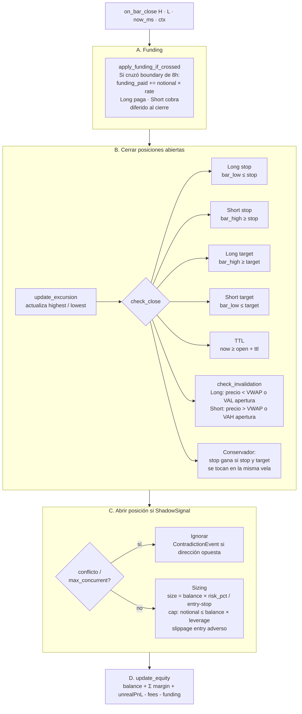

# Referencia: Strategy Layer

Archivos: `data/src/strategy/`

---

## Tipos (`types.rs`)

### Enums

```rust
enum Side { Long, Short }

enum StrategyId {
    ValueAreaFailedAuction,
    VwapValuePullbackContinuation,
    LvnLiquidityVacuumBreakout,
    LiquidationHunt,
    FundingExhaustionReversal,
    SmartMoneyDivergence,
}

enum StrategyAction { Wait, ShadowSignal, Blocked }

enum Regime {
    TrendUp, TrendDown, Chop, Compression,
    Expansion, Stress, Aftermath, Unknown,
}

enum DataQuality { Live, Fallback, Degraded, Stale, Missing }
enum ValueLocation { AboveVah, BelowVal, InValue, Unknown }
enum PriceRelation { Above, Below, At, Unknown }
enum AbsorptionSide { Bid, Ask, None, Unknown }
enum CvdDivergence { BearishAbsorption, BullishAbsorption }
enum ImbalanceSide { Bullish, Bearish, None, Unknown }
```

### Contextos

**`VolumeProfileContext`**
```rust
poc: Option<f64>         // Point of Control
vah: Option<f64>         // Value Area High
val: Option<f64>         // Value Area Low
hvn_nearby: Vec<f64>     // HVN dentro del 5% del precio actual
lvn_nearby: Vec<f64>     // LVN dentro del 5% del precio actual
value_location: ValueLocation
quality: DataQuality
```

**`VwapContext`**
```rust
vwap_session: Option<f64>     // VWAP desde 00:00 UTC
avwap_bos: Option<f64>        // AVWAP desde Break of Structure (futuro)
avwap_event: Option<f64>      // AVWAP desde evento macro (futuro)
price_vs_vwap: PriceRelation
price_vs_avwap_bos: PriceRelation
price_vs_avwap_event: PriceRelation
quality: DataQuality
```

**`OrderFlowContext`**
```rust
cvd: Option<f64>              // CVD acumulado total
cvd_slope: Option<f64>        // OLS slope del CVD history (ventana 10)
delta: Option<f64>            // buy_vol - sell_vol de la barra actual
taker_imbalance: Option<f64>  // delta normalizado [-1, +1]
buy_volume: Option<f64>
sell_volume: Option<f64>
vpin: Option<f64>             // toxicidad de flujo (>0.75 = tóxico)
cvd_divergence: Option<CvdDivergence>
footprint_absorption: AbsorptionSide
stacked_imbalance: ImbalanceSide
failed_acceptance: bool       // rechazo por encima del VAH o por debajo del VAL
sweep_confirmed: bool
mss_active: bool              // Market Structure Shift activo
quality: DataQuality
funding_rate: Option<f64>     // rate del perp (0.0001 = 1 bp)
basis: Option<f64>            // (perp/spot - 1) × 100 en %
oi_delta: Option<f64>         // cambio de OI en el período (contratos)
oi_momentum_aligned: Option<bool>
bid_wall_nearby: bool         // pared de bids dentro de 1×ATR
ask_wall_nearby: bool         // pared de asks dentro de 1×ATR
price_action_clean: bool      // ≤2 reversiones en las últimas 5 velas
```

**`OrderBookContext`**
```rust
obi_l5: Option<f64>       // Order Book Imbalance top 5 niveles
obi_l10: Option<f64>
obi_l20: Option<f64>
microprice: Option<f64>   // precio ponderado por liquidez del book
spread_bps: Option<f64>
walls_above: Vec<f64>     // precios de paredes de asks
walls_below: Vec<f64>     // precios de paredes de bids
thin_zone_above: bool     // zona de baja liquidez arriba del precio
thin_zone_below: bool
quality: DataQuality
```

**`StrategyMarketContext`** — contexto completo para cada bar-close:
```rust
symbol: String
timestamp_ms: i64
price: f64
regime: Regime
atr: Option<f64>
volume_profile: VolumeProfileContext
vwap: VwapContext
flow: OrderFlowContext
orderbook: OrderBookContext
institutional: Option<InstitutionalContext>  // None hasta primer fetch
```

### StrategySignal

```rust
struct StrategySignal {
    action: StrategyAction,
    strategy_id: Option<StrategyId>,
    side: Option<Side>,
    regime: Regime,
    entry_price: Option<f64>,
    stop_price: Option<f64>,
    target_price: Option<f64>,
    score: f64,           // 0.0–1.0
    ttl_ms: i64,          // duración máxima del trade en ms
    evidence: Vec<String>, // condiciones cumplidas
    missing: Vec<String>,  // condiciones faltantes o razón de bloqueo
    invalidation: Vec<String>, // condiciones que invalidan el trade mientras está abierto
    created_at_ms: i64,
}
```

### StrategyConfig (con defaults)

```rust
enabled: bool = false          // la estrategia no opera hasta que Supabase lo confirme
max_spread_bps: f64 = 2.0
max_vpin: f64 = 0.75
min_score: f64 = 0.60          // umbral de activación — calibrar con datos reales
default_ttl_ms: i64 = 5min

// LiquidationHunt
liq_hunt_min_usd: f64 = 500_000   // USD liquidados en 5min
liq_cascade_threshold: f64 = 5_000_000  // USD en 60s = cascade (demasiado tarde)
liq_ttl_ms: i64 = 10min

// FundingExhaustionReversal
funding_extreme_threshold: f64 = 0.0006  // 0.06% absoluto
funding_ttl_ms: i64 = 30min

// SmartMoneyDivergence
smart_short_threshold: f64 = 0.45    // top traders long < 45% → predominantemente short
retail_long_threshold: f64 = 0.60    // retail long > 60%
min_divergence: f64 = 0.18           // retail_long - top_traders_long
smd_ttl_ms: i64 = 20min
```

---

## Router (`router.rs`)

`route_strategy(ctx, cfg) → StrategySignal`



Los detectores institucionales solo corren cuando `institutional.is_some()` — esto garantiza que nunca toman decisiones con datos ausentes.

---

## Scorer (`scoring.rs`)

`score_signal(ctx, signal) → StrategySignal`

### Suma ponderada base (max = 1.0)

| Componente | Peso | Rango de entrada | Ramp |
|-----------|------|-----------------|------|
| CVD slope (signed) | 0.25 | [0.0, 1.0] | lineal |
| Taker imbalance (signed) | 0.20 | [0.0, 0.5] | lineal |
| Delta alineado (binario) | 0.10 | 0 o 1 | — |
| Target dist en ATR | 0.25 | [0.5, 3.0] ATR | lineal |
| R:R ratio | 0.20 | [1.0, 3.0] | lineal |

`ramp(value, min, max)` → mapeo lineal clampeado [0, 1].

"Signed" = multiplicado por `+1` para longs, `-1` para shorts — solo cuenta flujo alineado.

### Factores multiplicadores (post suma)

| Factor | Rango | Condición |
|--------|-------|-----------|
| VPIN tóxico (>0.75) | ×0.35 | veto fuerte |
| VPIN limpio (<0.30) | ×1.20 | amplificador |
| VPIN medio | interpolación suave | entre 0.30–0.75 |
| Spread ancho (>1.5 bps) | ×0.80 | penaliza |
| Régimen con trade | ×1.15 | TrendUp+Long, TrendDown+Short, Expansion |
| Régimen contra trade | ×0.70 | TrendDown+Long, TrendUp+Short |
| Confluencia VP (2 niveles) | ×1.10 | dentro de 0.25×ATR del target |
| Confluencia VP (3+ niveles) | ×1.20 | |

`score = base × factor_vpin × factor_spread × factor_regime × factor_confluencia`

### Regla de veto VPIN

Si VPIN > 0.75: `score = score.min(0.25)` — aplica también después de los ajustes aditivos.

### Ajustes aditivos post-producto (crypto-nativos)

Sumados después de la multiplicación para no amplificar los factores:

```rust
adapter::funding_score_penalty(funding_rate, is_long)   // penaliza funding adverso
adapter::oi_score_bonus(oi_momentum_aligned)             // premia alineación OI
adapter::wall_score_bonus(bid_wall_nearby, ask_wall_nearby, is_long)  // soporte/resistencia cercano
adapter::clean_action_score_bonus(price_action_clean)   // movimiento limpio sin chop
```

Score final: `clamp(0.0, 1.0)`.

---

## Paper Trading (`paper.rs`)

### PaperConfig (desde env vars)

| Env var | Default | Descripción |
|---------|---------|-------------|
| `PAPER_INITIAL_CAPITAL` | 3000.0 | Capital inicial USD |
| `PAPER_LEVERAGE` | 1.0 | Leverage (1 = sin apalancamiento) |
| `PAPER_MAX_POSITIONS` | 1 | Máx posiciones concurrentes |
| `PAPER_RISK_PCT` | 0.01 | Riesgo por trade (1% del balance) |
| `PAPER_SLIPPAGE_BPS` | 1.0 | Slippage por lado en basis points |
| `PAPER_TAKER_FEE` | 0.0004 | Fee taker (0.04% Binance perps) |
| `PAPER_FUNDING_RATE` | 0.0001 | Funding asumido (0.01% / 8h) |

### PaperPosition (struct)

Campos clave: `id`, `symbol`, `strategy_id`, `side`, `entry_price` (con slippage), `intended_entry` (sin slippage), `stop_price`, `target_price`, `size`, `notional`, `margin`, `score`, `opened_at_ms`, `ttl_ms`, `fees_paid`, `funding_paid`, `balance_at_open`, `highest`, `lowest`, `entry_vwap`, `entry_val`, `entry_vah`.

### ClosedTrade (struct)

Contabilidad completa: `gross_pnl`, `fees_paid`, `funding_paid`, `net_pnl`, `net_pnl_pct`, `mfe`, `mae`, `close_reason`.

```
net_pnl = gross_pnl - fees_paid - funding_paid
```

### Ciclo de vida de un trade



### Slippage — siempre adverso

```
Entry Long:  fill = price × (1 + bps/10000)   ← paga más
Entry Short: fill = price × (1 - bps/10000)   ← recibe menos
Exit Long:   fill = price × (1 - bps/10000)   ← recibe menos
Exit Short:  fill = price × (1 + bps/10000)   ← paga más
```

### Persistencia de estado

`paper_account_state.json` en `./logs/` — escritura atómica (write→rename).
Cargado en `PaperAccount::load_or_new()` al arrancar — posiciones abiertas se restauran y se evalúan normalmente en el siguiente bar-close.

### Archivos de log locales

| Archivo | Contenido |
|---------|-----------|
| `logs/paper_trades.jsonl` | Cada ClosedTrade al cierre |
| `logs/contradictions.jsonl` | ContradictionEvent (señal opuesta a posición abierta) |

---

## Outcome Tracker (`tracker.rs`)

### OutcomeTracker

Tracker en memoria — paralelo al paper account pero opera sobre señales "shadow" (no sobre posiciones reales). Mide MFE/MAE desde la señal original, no desde el fill con slippage.

```rust
pub struct OutcomeTracker {
    active: Vec<TrackedSignal>,
}
```

**`push_signal(symbol, signal, current_price)`**
- Solo acepta `StrategyAction::ShadowSignal`
- Deduplica por `(strategy_id, side)` — no acumula dos señales del mismo detector+dirección

**`update(high, low, now_ms)`**
- Actualiza `highest`/`lowest` de cada señal activa
- Si `close_reason()` → elimina de `active` y llama `log_outcome()`

**Lógica de cierre** (TrackedSignal):
- `STOP_HIT` → tiene precedencia si stop y target se tocan en el mismo bar
- `TARGET_HIT`
- `TTL_EXPIRED` → `now_ms >= created_at_ms + ttl_ms`

**OutcomeEntry** (escrito a JSONL):
```
symbol, created_at_ms, closed_at_ms, strategy, side,
entry_price, stop_price, target_price, score,
mfe, mae, mfe_r, mae_r, outcome
```
Donde `mfe_r = mfe / |entry - stop|`.

**Output**: `logs/strategy_outcomes.jsonl`

---

## Signal Logger (`logger.rs`)

`log_signal(ctx, signal)` — llamado en cada bar-close para cada señal, sin importar su resultado.

| Archivo | Condición |
|---------|-----------|
| `logs/strategy_signals.jsonl` | `action == ShadowSignal` |
| `logs/strategy_rejected.jsonl` | `action == Wait` |
| `logs/strategy_blocked.jsonl` | `action == Blocked` |

**SignalLogEntry** incluye:
- Identificación: `symbol`, `timestamp_ms`, `strategy`, `side`, `regime`, `action`
- Precios: `entry_price`, `stop_price`, `target_price`, `score`, `ttl_ms`
- Diagnosis: `evidence[]`, `missing[]`, `invalidation[]`
- **SignalContext** (snapshot del mercado en ese momento):
  ```
  price, vwap_session, poc, vah, val,
  cvd_slope, delta, vpin, spread_bps, obi_l5
  ```

El propósito de `strategy_rejected.jsonl` es calibrar el umbral `min_score`: si señales rechazadas por score bajo tienen buen MFE, el threshold está demasiado alto.

---

## Detectores

Todos los detectores tienen la misma firma:
```rust
// No-institucionales:
fn detect(ctx: &StrategyMarketContext, cfg: &StrategyConfig) -> Option<StrategySignal>

// Institucionales:
fn detect(ctx: &StrategyMarketContext, inst: &InstitutionalContext, cfg: &StrategyConfig) -> Option<StrategySignal>
```

Retornan `None` si no hay setup, `Some(StrategySignal { action: ShadowSignal, score: 0.0, ... })` con `score: 0.0` — el score real lo asigna `score_signal()` en el router.

Ver [estrategias individuales](../strategies/) para la lógica de detección de cada uno.

### Detectores no-institucionales (siempre activos si ATR ok)

| Detector | Side | Régimen favorito |
|---------|------|-----------------|
| ValueAreaFailedAuction | Short | TrendDown, Chop |
| LvnLiquidityVacuumBreakout | Long/Short | TrendUp, Expansion |
| VwapValuePullbackContinuation | Long/Short | TrendUp, TrendDown |

### Detectores institucionales (requieren `institutional` presente)

| Detector | Side | Régimen favorito |
|---------|------|-----------------|
| LiquidationHunt | contra la liquidación dominante | Expansion, Stress |
| FundingExhaustionReversal | contra el funding extremo | Chop, Aftermath |
| SmartMoneyDivergence | con smart money | cualquiera |

### ToxicFlowGate (`toxic_flow_gate.rs`)

Gate global que bloquea TODOS los detectores cuando las condiciones de mercado no son aptas:

```rust
fn toxic_flow_gate(ctx, cfg) -> Result<(), String>
```

Causas de bloqueo (`Err(reason)`):
- `"SPREAD_TOO_WIDE"` — spread > `cfg.max_spread_bps`
- `"VPIN_TOXIC"` — vpin > `cfg.max_vpin` con DataQuality::Live
- `"REGIME_STRESS"` — régimen es Stress o Aftermath
- `"ORDERBOOK_MISSING"` — depth ausente (quality Missing) en régimen Expansion o Stress

---

## Adapter (`adapter.rs`)

Funciones helper usadas por el scorer. No hay struct — solo funciones puras:

```rust
// Penaliza funding adverso al side del trade
funding_score_penalty(funding_rate: Option<f64>, is_long: bool) -> f64

// Bonus si OI momentum está alineado con el side
oi_score_bonus(oi_momentum_aligned: Option<bool>) -> f64

// Bonus si hay soporte cercano (long) o resistencia cercana (short)
wall_score_bonus(bid_wall_nearby: bool, ask_wall_nearby: bool, is_long: bool) -> f64

// Bonus si las últimas 5 velas son limpias (≤2 reversiones)
clean_action_score_bonus(price_action_clean: bool) -> f64
```
