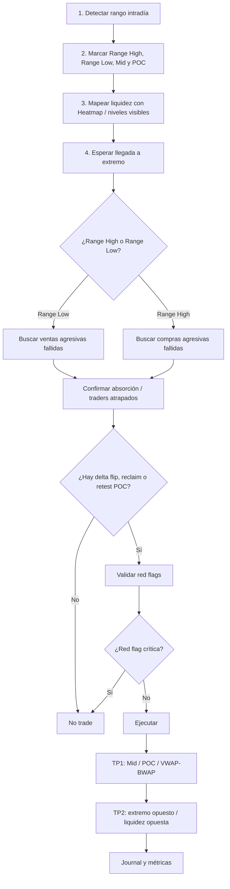
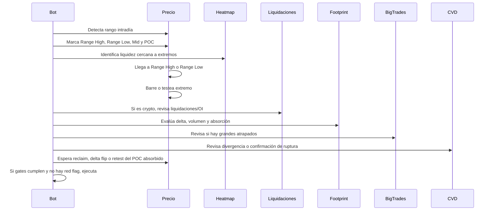

# Delta Range Reversal con Absorción

> **Documento de especificación estratégica para investigación, backtesting y paper trading.**  
> No es una recomendación financiera ni una invitación a operar dinero real. Si esto se salta a live sin validación, el problema no será el algoritmo: será el humano que le dio permiso, ese clásico error de diseño.

---

## 1. Propósito del documento

Este documento define una única estrategia intradía de Order Flow:

```text
Delta Range Reversal con Absorción
```

La estrategia está diseñada para operar **reversiones intradía en los extremos de un rango**, usando:

- Precio y estructura de rango.
- Volumen.
- Delta.
- CVD.
- Footprint.
- Absorción.
- Traders atrapados.
- Big Trades como confirmación opcional.
- Liquidaciones y Open Interest para crypto.
- Heatmap como mapa de liquidez.
- Volume Profile / POC como referencia interna del rango.
- VWAP/BWAP como target o filtro secundario.

La idea no es que el algoritmo "razone". La idea es que siga reglas. Si se cumplen los gates, opera. Si no, se queda quieto. Algo que, francamente, muchos traders humanos podrían intentar antes de arruinar otra cuenta.

---

## 2. Origen conceptual

La estrategia sale de las transcripciones sobre:

- **Estrategia de rangos basada en delta, volumen y CVD para índices y crypto.**
- **Patrones de entrada con Order Flow.**
- **Traders atrapados y liquidaciones.**
- **Big Trades.**
- **Footprint, delta, CVD y Open Interest.**

La transcripción de Delta Ranges plantea que estos rangos se forman cuando hay:

```text
Sellers / delta negativo en la parte alta del rango.
Buyers / delta positivo en la parte baja del rango.
Volumen incrementando en los extremos.
```

También remarca que en crypto puede darse el fenómeno inverso:

```text
Compradores mal posicionados arriba.
Vendedores mal posicionados abajo.
```

Eso ocurre porque las órdenes de mercado en crypto suelen ser agresivas y pueden quedar atrapadas. La idea central de esta estrategia es explotar ese fallo.

---

## 3. Tesis central

La tesis es simple:

```text
En un rango intradía, los extremos son zonas de decisión.

Si el precio llega a un extremo con volumen y delta agresivo,
pero no logra romper ni aceptar fuera del rango,
ese flujo queda atrapado.

Luego se busca la rotación hacia el centro del rango,
el POC, VWAP/BWAP o el extremo contrario.
```

Versión brutalmente resumida:

```text
No operamos el medio.
Operamos los extremos.
```

---

## 4. Mercados objetivo

| Mercado | Aplicación | Comentario |
|---|---|---|
| Futuros de índices | Alta | ES, NQ, YM, RTY. Requiere buena data de footprint. |
| Crypto perpetuals | Alta | BTC, ETH y principales pares líquidos. Añadir OI y liquidaciones. |
| Oro / metales | Media | Puede funcionar, pero requiere calibración propia. |
| Forex spot | Baja/media | Depende de la calidad del volumen disponible. |
| Acciones | Media | Requiere datos robustos de tape/volumen por precio. |

---

## 5. Timeframes sugeridos

### Futuros / índices

```text
Contexto: M15 / M30
Rango operativo: M5 / M15
Ejecución: M1 / M5
Footprint: M1 / M5
```

### Crypto

```text
Contexto: M15 / M30 / H1
Rango operativo: M5 / M15 / M30
Ejecución: M1 / M5 / M15
Footprint: M1 / M5 / M15
Extra: Open Interest + liquidaciones
```

---

## 6. Herramientas y momento de uso

| Herramienta | Momento | Función | ¿Dispara entrada? |
|---|---|---|---|
| Precio / velas | Fase 1 | Detectar rango | No |
| Volume Profile | Fase 1 | POC, value, mid, zonas internas | No |
| Heatmap | Fase 2 | Mapear liquidez real | No |
| Liquidaciones | Fase 3 | Confirmar limpieza de liquidez en crypto | No, sola no |
| Open Interest | Fase 3 | Ver cierre/entrada de posiciones en crypto | No |
| Footprint | Fase 4 | Confirmar absorción real | Sí, con trigger |
| Delta | Fase 4 | Medir agresión y fallo | Sí, con reclaim/flip |
| CVD | Fase 4 | Confirmar divergencia o ruptura real | Filtro |
| Big Trades | Fase 4 | Detectar traders grandes atrapados | Confirmación |
| Finish Action | Fase 4 | Ver drenaje de interés | Confluencia |
| VWAP/BWAP | Fase 5 | Target/filtro secundario | No principal |

---

## 7. Flujo general de la estrategia



---

## 8. Secuencia temporal del setup



---

## 9. Fase 1: detección del rango

### Objetivo

Identificar una estructura lateral suficientemente clara como para operar extremos.

### Rango válido

Un rango válido debe cumplir:

```text
1. High y low relativamente definidos.
2. Mínimo dos interacciones con un extremo.
3. Precio contenido dentro del rango durante una cantidad mínima de velas.
4. No hay expansión tendencial fuerte.
5. El rango tiene tamaño suficiente para pagar el riesgo.
```

### Parámetros iniciales sugeridos

Estos son placeholders. No se copian ciegamente. Se calibran por activo, sesión y timeframe.

```yaml
range_detection:
  min_bars_inside_range: 20
  min_touches_total: 3
  min_touches_each_side: 1
  max_slope_midline: 0.15
  min_range_size_atr: 0.8
  max_range_size_atr: 3.5
  middle_zone_percentage: 0.35
```

### Variables

```yaml
range_variables:
  range_high: highest_swing_within_window
  range_low: lowest_swing_within_window
  range_mid: (range_high + range_low) / 2
  range_size: range_high - range_low
  range_poc: volume_profile_poc_inside_range
  range_vah: value_area_high_inside_range
  range_val: value_area_low_inside_range
```

---

## 10. Fase 2: zonas operativas

La estrategia solo puede operar en:

```text
Range High
Range Low
Desviación/reclaim del extremo
Zona de liquidez cercana al extremo
POC absorbido en la mecha
```

No se opera:

```text
Medio del rango
Zonas sin liquidez
Zonas donde el target queda demasiado cerca
Rupturas confirmadas
```

### Zona de no trade

```yaml
no_trade_zone:
  name: middle_zone
  definition: price_between_35_percent_and_65_percent_of_range
  action: no_trade
```

Sí, el medio es tentador. También lo es responderle a trolls en internet. Ninguna de las dos cosas suele terminar bien.

---

## 11. Fase 3: uso del Heatmap

### Cuándo se usa

Antes de la entrada, mientras el precio se aproxima al extremo.

### Para qué sirve

El Heatmap ayuda a detectar:

```text
Órdenes límite grandes.
Liquidez real cerca del rango.
Zonas donde el precio puede ir a barrer.
Niveles donde puede haber reacción.
```

### No sirve para

```text
Entrar directamente.
Confirmar absorción.
Sustituir footprint/delta.
```

### Regla

```yaml
heatmap_gate:
  phase: pre_entry_mapping
  valid_if:
    - liquidity_cluster_near_range_extreme: true
    - distance_to_extreme_within_tolerance: true
  output:
    - refined_sweep_zone
    - likely_liquidity_target
```

### Ejemplo

```text
Range Low = 65,700
Heatmap muestra liquidez fuerte en 65,650

Conclusión:
La barrida real puede buscar 65,650,
no necesariamente detenerse en 65,700.
```

---

## 12. Fase 4: liquidaciones y Open Interest en crypto

Esta parte se usa principalmente en **crypto perpetuals**.

### Liquidaciones

Las liquidaciones validan que el mercado limpió posiciones.

#### Long en Range Low

```text
Precio rompe o pincha Range Low.
Aparecen liquidaciones de longs.
Luego entran shorts tarde apostando breakdown.
Si el precio reclama, esos shorts quedan atrapados.
```

#### Short en Range High

```text
Precio rompe o pincha Range High.
Aparecen liquidaciones de shorts.
Luego entran longs tarde apostando breakout.
Si el precio vuelve dentro, esos longs quedan atrapados.
```

### Open Interest

El Open Interest ayuda a leer si:

```text
Se están cerrando posiciones.
Están entrando posiciones nuevas.
El movimiento tiene fuerza real.
La barrida fue liquidación o entrada agresiva.
```

### Uso crypto

```yaml
crypto_optional_confirmation:
  liquidation_gate:
    valid_if:
      - liquidation_cluster_at_extreme: true
      - liquidation_size_above_relative_threshold: true
      - liquidation_size_compared_to_recent_baseline: true

  open_interest_gate:
    valid_if_any:
      - oi_decreases_on_sweep
      - oi_increases_after_reclaim_with_delta_flip
      - oi_confirms_new_positions_against_trapped_side
```

### Regla importante

```text
Liquidaciones sin absorción = no trade.
Liquidaciones + absorción + reclaim = setup válido.
```

---

## 13. Fase 5: footprint, delta y absorción

Esta es la fase central. Aquí se decide si existe operación.

### Absorción alcista en Range Low

Buscamos:

```text
1. Precio llega o barre Range Low.
2. Entra delta negativo agresivo.
3. Incrementa el volumen.
4. La vela no cierra con aceptación bajo el rango.
5. El POC de la vela queda en la mecha baja o cerca del low.
6. El cierre vuelve dentro del rango o encima del nivel.
7. La siguiente vela cambia a delta positivo o aparece reclaim.
```

### Absorción bajista en Range High

Buscamos:

```text
1. Precio llega o barre Range High.
2. Entra delta positivo agresivo.
3. Incrementa el volumen.
4. La vela no cierra con aceptación encima del rango.
5. El POC de la vela queda en la mecha alta o cerca del high.
6. El cierre vuelve dentro del rango o debajo del nivel.
7. La siguiente vela cambia a delta negativo o aparece reclaim bajista.
```

### Fórmula conceptual

```text
Agresión fuerte + falta de progreso = absorción posible.
Agresión fuerte + cierre fuera + aceptación = ruptura real.
```

---

## 14. Setup Long: Range Low Absorption

### Descripción

Comprar en el extremo inferior del rango cuando las ventas agresivas intentan romper, pero fallan y quedan atrapadas.

### Condiciones completas

```yaml
setup_id: delta_range_reversal_long_absorption

context_gates:
  market_regime: range
  valid_intraday_range: true
  price_location: range_low_zone
  no_trade_middle_zone: false

zone_gates:
  price_near_range_low: true
  distance_to_low_less_than_tolerance: true
  liquidity_zone_near_low_optional: true
  range_low_sweep_optional: true

orderflow_gates:
  aggressive_selling_into_low: true
  delta_negative_expansion: true
  volume_expansion_at_low: true
  price_fails_to_accept_below_low: true
  close_back_inside_range: true

absorption_gates:
  any_required:
    - poc_in_lower_wick
    - delta_negative_absorbed
    - big_sell_trades_trapped
    - cvd_bullish_divergence
    - liquidation_cluster_at_low_crypto

trigger_gates:
  any_required:
    - delta_flip_positive
    - reclaim_range_low
    - retest_absorbed_poc
    - bullish_close_confirmation
    - engulfing_reclaim

red_flags:
  reject_if:
    - strong_close_below_range_low
    - next_candle_accepts_below_range
    - delta_continues_negative_after_break
    - cvd_breaks_down_with_price
    - volume_expands_in_breakout_direction
    - no_reclaim_within_n_bars
    - risk_reward_below_minimum

entry:
  side: long
  entry_modes:
    aggressive: retest_absorbed_poc
    conservative: close_confirmation_after_delta_flip
    alternative: reclaim_range_low

stop:
  primary: below_sweep_low
  secondary: below_absorption_low
  emergency: fixed_max_loss

targets:
  tp1: range_mid_or_poc
  tp2: range_high
  optional:
    - vwap_or_bwap
    - opposite_liquidity_pool
```

### Lectura humana

Los vendedores intentan romper el rango. No pueden. Si el precio vuelve dentro, esos vendedores quedan mal posicionados. La entrada busca castigar ese fallo. El mercado, como siempre, haciendo bullying con Excel y contratos.

---

## 15. Setup Short: Range High Absorption

### Descripción

Vender en el extremo superior del rango cuando las compras agresivas intentan romper, pero fallan y quedan atrapadas.

### Condiciones completas

```yaml
setup_id: delta_range_reversal_short_absorption

context_gates:
  market_regime: range
  valid_intraday_range: true
  price_location: range_high_zone
  no_trade_middle_zone: false

zone_gates:
  price_near_range_high: true
  distance_to_high_less_than_tolerance: true
  liquidity_zone_near_high_optional: true
  range_high_sweep_optional: true

orderflow_gates:
  aggressive_buying_into_high: true
  delta_positive_expansion: true
  volume_expansion_at_high: true
  price_fails_to_accept_above_high: true
  close_back_inside_range: true

absorption_gates:
  any_required:
    - poc_in_upper_wick
    - delta_positive_absorbed
    - big_buy_trades_trapped
    - cvd_bearish_divergence
    - liquidation_cluster_at_high_crypto

trigger_gates:
  any_required:
    - delta_flip_negative
    - reclaim_below_range_high
    - retest_absorbed_poc
    - bearish_close_confirmation
    - engulfing_reclaim_down

red_flags:
  reject_if:
    - strong_close_above_range_high
    - next_candle_accepts_above_range
    - delta_continues_positive_after_break
    - cvd_breaks_up_with_price
    - volume_expands_in_breakout_direction
    - no_reclaim_within_n_bars
    - risk_reward_below_minimum

entry:
  side: short
  entry_modes:
    aggressive: retest_absorbed_poc
    conservative: close_confirmation_after_delta_flip
    alternative: reclaim_below_range_high

stop:
  primary: above_sweep_high
  secondary: above_absorption_high
  emergency: fixed_max_loss

targets:
  tp1: range_mid_or_poc
  tp2: range_low
  optional:
    - vwap_or_bwap
    - opposite_liquidity_pool
```

---

## 16. Big Trades dentro de la estrategia

Los Big Trades no son la estrategia. Son confirmación.

### Big Trades válidos

```text
Aparecen en Range High o Range Low.
Aparecen en dirección del intento fallido.
El precio no continúa.
El cierre queda contra esos Big Trades.
```

### Long

```text
Big sell trades en Range Low.
Precio no baja.
Cierre dentro del rango.
Vendedores grandes atrapados.
```

### Short

```text
Big buy trades en Range High.
Precio no sube.
Cierre dentro del rango.
Compradores grandes atrapados.
```

### YAML

```yaml
big_trades_confirmation:
  enabled: optional
  valid_only_at_extremes: true
  long_condition:
    - big_sell_trades_at_range_low
    - price_fails_to_continue_down
    - close_back_inside_range
  short_condition:
    - big_buy_trades_at_range_high
    - price_fails_to_continue_up
    - close_back_inside_range
```

### Big Trades inválidos

```text
Big Trades en el medio del rango.
Big Trades con cierre fuerte fuera del rango.
Big Trades que acompañan ruptura real.
Big Trades sin zona previa.
```

---

## 17. CVD dentro de la estrategia

El CVD sirve como filtro de presión acumulada.

### Casos útiles

#### Divergencia alcista

```text
Precio hace igual o menor low.
CVD no hace nuevo low.
Posible pérdida de fuerza vendedora.
```

#### Divergencia bajista

```text
Precio hace igual o mayor high.
CVD no hace nuevo high.
Posible pérdida de fuerza compradora.
```

#### Ruptura real

```text
Precio rompe rango.
CVD rompe en la misma dirección.
Delta acompaña.
Volumen expande.
No se hace fade.
```

### YAML

```yaml
cvd_filter:
  bullish_reversal_support:
    - price_sweeps_low
    - cvd_higher_low_or_flat
  bearish_reversal_support:
    - price_sweeps_high
    - cvd_lower_high_or_flat
  breakout_rejection:
    reject_if:
      - cvd_breaks_with_price
      - delta_confirms_breakout
```

---

## 18. Cómo distinguir absorción de ruptura real

### Absorción

```text
Precio toca o barre extremo.
Delta agresivo entra.
Volumen aumenta.
Precio no acepta fuera del rango.
Cierre vuelve dentro.
Delta posterior cambia.
```

### Ruptura real

```text
Precio rompe extremo.
Volumen aumenta.
Delta acompaña ruptura.
Cierra fuera.
Siguiente vela acepta fuera.
CVD acompaña ruptura.
```

### Regla algorítmica

```yaml
breakout_real:
  true_if:
    - close_outside_range
    - next_candle_accepts_outside_range
    - volume_expansion_in_breakout_direction
    - delta_expansion_in_breakout_direction
    - cvd_confirms_breakout

fade_allowed:
  true_if:
    - breakout_real == false
    - absorption_detected == true
    - reclaim_detected == true
```

---

## 19. Reglas de entrada

### Entrada agresiva

```text
Retest del POC absorbido.
```

Ventaja:

```text
Mejor precio.
Mejor RR.
```

Desventaja:

```text
No siempre da retest.
Más riesgo de entrada temprana.
```

### Entrada conservadora

```text
Cierre confirmatorio después de delta flip.
```

Ventaja:

```text
Más confirmación.
Menos entradas falsas.
```

Desventaja:

```text
Peor precio.
Puede perderse el movimiento.
```

### Entrada alternativa

```text
Reclaim del Range High/Low.
```

---

## 20. Stop Loss

### Long

```text
Stop principal: debajo del low de la barrida.
Stop secundario: debajo del low de absorción.
```

### Short

```text
Stop principal: encima del high de la barrida.
Stop secundario: encima del high de absorción.
```

### Stop inválido

```text
Stop en medio del rango.
Stop sin relación con la estructura.
Stop fijo sin considerar volatilidad.
```

---

## 21. Targets

### TP1

```text
Range Mid.
POC del rango.
VWAP/BWAP si está cerca.
```

### TP2

```text
Extremo opuesto del rango.
Liquidez opuesta.
VAH/VAL intradía si coincide.
```

### Gestión simple para MVP

```yaml
trade_management:
  min_rr_to_tp1: 1.0
  min_rr_to_tp2: 1.5
  partial_at_tp1: 0.5
  move_stop_to_breakeven_after_tp1: true
  final_target: opposite_range_extreme
```

---

## 22. Red flags críticas

Cancelar trade si aparece cualquiera de estas:

```text
1. Cierre fuerte fuera del rango.
2. Aceptación fuera del rango en vela siguiente.
3. Delta continúa en dirección de ruptura.
4. CVD rompe en dirección de ruptura.
5. Volumen expande con cierre fuera.
6. No hay reclaim.
7. Precio está en medio del rango.
8. El target está demasiado cerca.
9. Riesgo/beneficio insuficiente.
10. Hay noticia de alto impacto cerca.
```

### YAML

```yaml
critical_red_flags:
  - strong_close_outside_range
  - acceptance_outside_range
  - delta_continuation_breakout
  - cvd_breakout_confirmation
  - no_reclaim
  - middle_zone
  - rr_below_minimum
  - high_impact_news_window
```

---

## 23. Score de calidad

Además de gates obligatorios, se puede usar un sistema de puntos.

| Señal | Peso |
|---|---:|
| Rango válido | +2 |
| Precio en extremo | +2 |
| Liquidez visible en heatmap | +1 |
| Liquidaciones en extremo, crypto | +1 |
| Delta agresivo fallido | +3 |
| POC en mecha | +2 |
| Delta flip | +2 |
| CVD divergente | +1 |
| Big Trades atrapados | +2 |
| Reclaim claro | +2 |
| Red flag crítica | -99 |

### Regla

```yaml
quality_score:
  min_score_to_trade: 8
  critical_red_flag_override: true
```

Si hay red flag crítica, no opera aunque el score sea alto. Porque los números no deben servir para justificar una mala idea. Para eso ya están los grupos de Telegram.

---

## 24. Pseudocódigo

```python
def detect_delta_range_reversal(market):
    range_data = detect_intraday_range(market)

    if not range_data.valid:
        return None

    if price_in_middle_zone(market.price, range_data):
        return None

    # LONG SETUP
    if near_range_low(market.price, range_data):
        absorption = detect_sell_absorption_at_low(market, range_data)
        breakout = detect_real_breakout_down(market, range_data)

        if breakout:
            return None

        if absorption:
            trigger = (
                delta_flip_positive(market)
                or reclaim_range_low(market, range_data)
                or retest_absorbed_poc(market)
            )

            if trigger and risk_reward_valid(market, range_data, side="long"):
                return {
                    "setup": "delta_range_reversal_long_absorption",
                    "side": "long",
                    "entry": "reclaim_or_absorbed_poc_retest",
                    "stop": range_data.sweep_low - market.buffer,
                    "tp1": range_data.poc_or_mid,
                    "tp2": range_data.high,
                }

    # SHORT SETUP
    if near_range_high(market.price, range_data):
        absorption = detect_buy_absorption_at_high(market, range_data)
        breakout = detect_real_breakout_up(market, range_data)

        if breakout:
            return None

        if absorption:
            trigger = (
                delta_flip_negative(market)
                or reclaim_below_range_high(market, range_data)
                or retest_absorbed_poc(market)
            )

            if trigger and risk_reward_valid(market, range_data, side="short"):
                return {
                    "setup": "delta_range_reversal_short_absorption",
                    "side": "short",
                    "entry": "reclaim_or_absorbed_poc_retest",
                    "stop": range_data.sweep_high + market.buffer,
                    "tp1": range_data.poc_or_mid,
                    "tp2": range_data.low,
                }

    return None
```

---

## 25. Diccionario de features

| Feature | Descripción |
|---|---|
| `range_high` | Máximo validado del rango |
| `range_low` | Mínimo validado del rango |
| `range_mid` | Punto medio del rango |
| `range_poc` | POC del rango según Volume Profile |
| `price_near_extreme` | Precio dentro de tolerancia del high/low |
| `delta_expansion` | Delta mayor que baseline reciente |
| `volume_expansion` | Volumen mayor que media reciente |
| `poc_in_wick` | POC de la vela en mecha de rechazo |
| `delta_flip` | Delta cambia de signo tras absorción |
| `cvd_divergence` | CVD no confirma nuevo extremo |
| `liquidation_cluster` | Liquidaciones agrupadas en zona |
| `oi_change` | Cambio de Open Interest |
| `big_trade_trapped` | Big Trade falla en extremo |
| `acceptance_outside_range` | Cierre y permanencia fuera del rango |
| `reclaim` | Recuperación del nivel roto |

---

## 26. Parámetros pendientes de calibración

Estos no están definidos numéricamente en las transcripciones. Hay que medirlos.

```yaml
parameters_to_calibrate:
  range_window_bars: null
  min_range_touches: null
  extreme_tolerance_ticks: null
  volume_expansion_multiplier: null
  delta_expansion_multiplier: null
  big_trade_min_size: null
  liquidation_relative_threshold: null
  oi_change_threshold: null
  cvd_divergence_lookback: null
  acceptance_bars_outside_range: null
  max_bars_for_reclaim: null
  min_rr: null
```

Traducción: aquí empieza el trabajo real. La parte donde la fantasía del setup se enfrenta a datos, comisiones y el desprecio indiferente del mercado.

---

## 27. Backtesting mínimo

### Debe incluir

```text
1. Comisiones.
2. Slippage.
3. Spread.
4. Horario de sesión.
5. Noticias.
6. Liquidez por activo.
7. Diferenciación futuros vs crypto.
8. Datos reales de footprint si se puede.
9. Liquidaciones y OI solo donde existan.
10. Separación por setup long/short.
```

### Métricas

```yaml
metrics:
  - number_of_trades
  - winrate
  - profit_factor
  - expectancy
  - average_R
  - median_R
  - max_drawdown
  - MAE
  - MFE
  - average_time_in_trade
  - session_performance
  - long_vs_short_performance
  - futures_vs_crypto_performance
```

---

## 28. Journal automático

Cada trade debe guardar:

```yaml
journal_fields:
  timestamp: null
  market: null
  session: null
  setup_id: null
  side: null
  range_high: null
  range_low: null
  entry_price: null
  stop_price: null
  tp1: null
  tp2: null
  delta_at_entry: null
  volume_at_entry: null
  cvd_state: null
  big_trade_present: null
  liquidation_present: null
  oi_state: null
  entry_mode: null
  exit_reason: null
  result_R: null
  screenshot_path: null
```

---

## 29. Implementación por fases

### Fase 1: MVP básico

```text
Detectar rango.
Detectar extremos.
Detectar delta/volumen en extremo.
Detectar reclaim.
Ejecutar hacia POC/mid.
```

### Fase 2: Absorción avanzada

```text
POC en mecha.
Delta flip.
CVD divergence.
Rechazo de ruptura real.
```

### Fase 3: Crypto extras

```text
Liquidaciones.
Open Interest.
Big Trades.
```

### Fase 4: Gestión avanzada

```text
TP parcial.
BE.
Trailing por delta/CVD.
Filtro de noticias.
Filtro por sesión.
```

---

## 30. Checklist operativo

Antes de operar:

```text
[ ] ¿Hay rango válido?
[ ] ¿El precio está en un extremo?
[ ] ¿Hay suficiente espacio hasta TP1?
[ ] ¿Hay volumen en el extremo?
[ ] ¿El delta agresivo falló?
[ ] ¿Hay cierre de vuelta dentro del rango?
[ ] ¿Hay delta flip o reclaim?
[ ] ¿No hay aceptación fuera?
[ ] ¿No hay CVD confirmando ruptura?
[ ] ¿El RR mínimo se cumple?
```

Si marcas menos de lo necesario y aun así entras, el bot no falló. Falló el criterio, ese villano recurrente.

---

## 31. Resumen final de la estrategia

```text
Nombre:
Delta Range Reversal con Absorción

Tipo:
Order Flow intradía de rango

Mercados:
Futuros, índices y crypto

Entrada:
Extremos de rango

Confirmación:
Volumen + delta + footprint + absorción

Extra crypto:
Liquidaciones + Open Interest

Extra opcional:
Heatmap + Big Trades + VWAP/BWAP

Targets:
POC/mid y extremo opuesto

Invalidación:
Aceptación fuera del rango con delta, volumen y CVD confirmando ruptura
```

---

## 32. Fuentes externas consultadas

- ATAS Help: Big Trades  
  https://help.atas.net/en/support/solutions/articles/72000602332-big-trades

- ATAS Liquidity Analysis / Heatmap  
  https://atas.net/features/liquidity-analysis/

- ATAS Order Flow Training  
  https://atas.net/blog/order-flow-in-trading-free-training-by-atas/

- CME Performance Bonds / Margins  
  https://www.cmegroup.com/solutions/risk-management/performance-bonds-margins.html

- CME Product Margins  
  https://www.cmegroup.com/solutions/risk-management/margin-services/product-margins.html
