# Especificación Estratégica de Order Flow: Familias, Setups y Gates para Trading Algorítmico

> **Propósito del documento:** separar el contenido de los documentos compartidos en familias estratégicas, explicar cómo se complementan, convertir cada idea en una estructura de *gates* programables y señalar qué falta para pasar de lógica discrecional a trading algorítmico.

> **Nota de riesgo:** este documento es material de investigación, diseño de sistemas y backtesting. No es asesoramiento financiero ni recomendación de operar dinero real. Futuros, índices, oro y cripto pueden tener riesgo elevado, apalancamiento, slippage, latencia, comisiones y cambios de margen. La automatización no elimina el riesgo; solo permite cometer errores más rápido si se diseña mal. Qué avance tan humano.

---

## Índice

1. [Resumen ejecutivo](#1-resumen-ejecutivo)
2. [Mapa general del sistema](#2-mapa-general-del-sistema)
3. [Motor común de todas las estrategias](#3-motor-común-de-todas-las-estrategias)
4. [Taxonomía de estrategias](#4-taxonomía-de-estrategias)
5. [Estrategia 1: Volume Profile Open](#5-estrategia-1-volume-profile-open)
6. [Estrategia 2: Rotación de Value Area](#6-estrategia-2-rotación-de-value-area)
7. [Estrategia 3: Continuación por LVN / Volume Gaps](#7-estrategia-3-continuación-por-lvn--volume-gaps)
8. [Estrategia 4: Delta Ranges](#8-estrategia-4-delta-ranges)
9. [Estrategia 5: Absorción / Traders Atrapados](#9-estrategia-5-absorción--traders-atrapados)
10. [Estrategia 6: Liquidaciones + Naked POC](#10-estrategia-6-liquidaciones--naked-poc)
11. [Estrategia 7: Big Trades](#11-estrategia-7-big-trades)
12. [Estrategia 8: BWAP / VWAP + Big Trades](#12-estrategia-8-bwap--vwap--big-trades)
13. [Estrategia 9: Order Block + Order Flow](#13-estrategia-9-order-block--order-flow)
14. [Estrategia 10: Oro / Swing con OTE + Naked POC + Cluster](#14-estrategia-10-oro--swing-con-ote--naked-poc--cluster)
15. [Módulos transversales](#15-módulos-transversales)
16. [Cómo se complementan las estrategias](#16-cómo-se-complementan-las-estrategias)
17. [Matriz de compatibilidad](#17-matriz-de-compatibilidad)
18. [Arquitectura algorítmica recomendada](#18-arquitectura-algorítmica-recomendada)
19. [Esquema de datos mínimo](#19-esquema-de-datos-mínimo)
20. [Especificación tipo YAML por setup](#20-especificación-tipo-yaml-por-setup)
21. [Lo que falta en los documentos para automatizar](#21-lo-que-falta-en-los-documentos-para-automatizar)
22. [Plan de implementación por fases](#22-plan-de-implementación-por-fases)
23. [Plan de backtesting](#23-plan-de-backtesting)
24. [Métricas por setup](#24-métricas-por-setup)
25. [Conclusión operativa](#25-conclusión-operativa)
26. [Fuentes externas verificadas](#26-fuentes-externas-verificadas)

---

# 1. Resumen ejecutivo

De todos los documentos compartidos se forman **10 familias estratégicas principales**. No todas son estrategias independientes. Algunas son estrategias madre, otras son setups de entrada y otras son módulos de confirmación.

El error típico sería intentar programarlas como reglas aisladas:

```python
if big_trade:
    buy()
```

Eso no es trading algorítmico. Eso es darle un botón rojo a una tostadora y esperar inteligencia institucional.

La estructura correcta es:

```text
Contexto → Régimen → Zona → Trigger → Filtros → Ejecución → Gestión → Registro
```

Las familias estratégicas detectadas son:

| Nº | Familia estratégica | Rol principal | Mejor régimen |
|---:|---|---|---|
| 1 | Volume Profile Open | Contexto + ejecución por apertura | Rango o tendencia según variante |
| 2 | Rotación de Value Area | Rango / balance | Balance |
| 3 | Continuación por LVN / Volume Gaps | Continuación tendencial | Tendencia |
| 4 | Delta Ranges | Rango, fakeout o breakout | Rango |
| 5 | Absorción / Traders Atrapados | Trigger transversal y reversal | Zonas clave |
| 6 | Liquidaciones + Naked POC | Reversal cripto | Barridas/liquidaciones |
| 7 | Big Trades | Reversal o continuación | Depende de locación |
| 8 | BWAP / VWAP + Big Trades | Intradía / scalping | Sesión intradía |
| 9 | Order Block + Order Flow | SMC filtrado por volumen | Pullback/reversal |
| 10 | Oro / Swing OTE + Naked POC | Swing/day trade en oro | Tendencia o reversal HTF |

La idea final para automatización:

```text
El bot no debe “razonar”.
Debe evaluar gates.
Si todos los gates se cumplen, opera.
Si falta uno, no opera.
Si aparece una red flag, cancela.
```

---

# 2. Mapa general del sistema

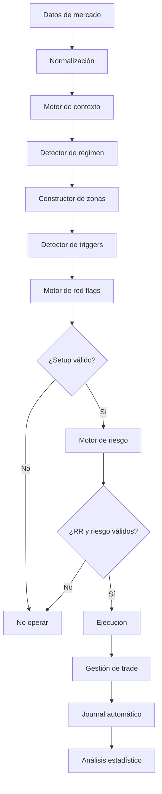

## Lectura del diagrama

El sistema completo debe comportarse como una línea de ensamblaje:

1. Recibe datos.
2. Determina contexto.
3. Decide si el mercado está en rango o tendencia.
4. Construye zonas objetivas.
5. Espera triggers.
6. Revisa red flags.
7. Evalúa riesgo.
8. Ejecuta.
9. Gestiona.
10. Registra.

El algoritmo no debe tomar decisiones “porque se ve bien”. Esa frase debería estar prohibida en cualquier sistema automatizado, junto con “esta vez es diferente”.

---

# 3. Motor común de todas las estrategias

Todas las estrategias de los documentos pueden reducirse a este motor:

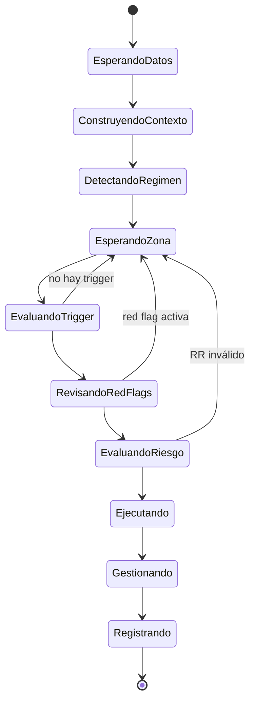

## 3.1 Gates globales

```text
GATE 1: Mercado permitido
GATE 2: Sesión permitida
GATE 3: Régimen detectado
GATE 4: Bias válido
GATE 5: Zona objetiva activa
GATE 6: Trigger confirmado
GATE 7: Red flags ausentes
GATE 8: Riesgo/beneficio mínimo
GATE 9: Orden ejecutable
GATE 10: Gestión definida
```

## 3.2 Variables comunes

```yaml
market_data:
  timestamp: datetime
  open: float
  high: float
  low: float
  close: float
  volume: float
  bid_volume: float
  ask_volume: float
  delta: float
  cvd: float
  open_interest: float | null

profile_levels:
  current_poc: float
  current_vah: float
  current_val: float
  previous_day_poc: float
  previous_day_vah: float
  previous_day_val: float
  previous_week_poc: float
  previous_week_vah: float
  previous_week_val: float
  naked_pocs: list[float]
  lvn_zones: list[zone]
  hvn_zones: list[zone]

session_levels:
  daily_open: float
  session_open: float
  previous_day_high: float
  previous_day_low: float
  previous_week_high: float
  previous_week_low: float

flow_signals:
  big_trades: list[event]
  absorption_events: list[event]
  liquidation_events: list[event]
  delta_flip: bool
  delta_drain: bool
  unfinished_auction: bool
```

## 3.3 Reglas universales

```text
No contexto = no trade
No zona = no trade
No trigger = no trade
No invalidación clara = no trade
Red flag activa = no trade
```

---

# 4. Taxonomía de estrategias

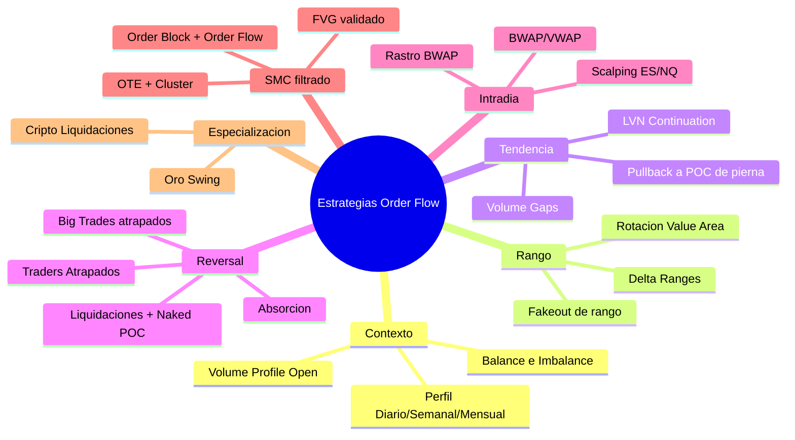

---

# 5. Estrategia 1: Volume Profile Open

## 5.1 Qué es

Estrategia basada en dónde abre la sesión actual respecto al perfil de volumen anterior.

Sirve para definir:

- bias diario;
- tipo de día;
- zonas iniciales;
- target probable;
- si el día debe tratarse como rango o tendencia.

## 5.2 Tipo

**Estrategia madre de contexto y ejecución.**

## 5.3 Mercados

```text
Futuros: ES, NQ, GC, 6E
Índices
Oro
Cripto, con ajustes
```

## 5.4 Datos necesarios

```yaml
inputs:
  current_open: float
  previous_vah: float
  previous_val: float
  previous_poc: float
  previous_high: float
  previous_low: float
  daily_open: float
  acceptance_time_minutes: int
```

---

## 5.5 Setup 1A: Apertura dentro del value anterior

### Condición

```python
open_between_poc_and_vah = previous_poc < current_open < previous_vah
open_between_val_and_poc = previous_val < current_open < previous_poc
```

### Lectura

Mercado en balance.

### Acción

```python
if open_between_poc_and_vah:
    preferred_trade = "short_at_VAH"
    tp1 = previous_poc
    tp2 = previous_val

if open_between_val_and_poc:
    preferred_trade = "long_at_VAL"
    tp1 = previous_poc
    tp2 = previous_vah
```

### Stop

```yaml
stop_options:
  conservative:
    long: below_previous_low
    short: above_previous_high
  aggressive:
    long: below_local_swing_low
    short: above_local_swing_high
```

### Complementos

- Absorción.
- Big Trades atrapados.
- Delta drain.
- Reversal footprint.
- Velas de volumen.

---

## 5.6 Setup 1B: Apertura fuera del value pero dentro del rango previo

### Condición alcista moderada

```python
current_open > previous_vah and current_open < previous_high
```

### Condición bajista moderada

```python
current_open < previous_val and current_open > previous_low
```

### Lectura

Hay intención direccional, pero aún no hay ruptura total del rango previo.

### Acción

```python
if open_above_value_inside_range:
    wait_for_acceptance_inside_value()
    entry_zone = previous_poc
    target = daily_open

if open_below_value_inside_range:
    wait_for_acceptance_inside_value()
    entry_zone = previous_poc
    target = daily_open
```

---

## 5.7 Setup 1C: Apertura fuera del value y fuera del high/low previo

### Condición alcista

```python
current_open > previous_high and current_open > previous_vah
```

### Condición bajista

```python
current_open < previous_low and current_open < previous_val
```

### Lectura

Día tendencial.

### Acción

```python
if trend_day_up:
    look_for_long_continuation()
    targets = ["previous_week_value", "naked_poc", "external_liquidity"]

if trend_day_down:
    look_for_short_continuation()
    targets = ["previous_week_value", "naked_poc", "external_liquidity"]
```

### Caso especial: gap grande

```python
if distance(current_open, previous_vah_or_val) > max_retest_distance:
    wait_for_ltf_range()
    trade_extreme_in_trend_direction()
```

---

## 5.8 Setup 1D: Apertura fuera pero reacepta dentro del value

### Condición

```python
opened_outside_value = current_open > previous_vah or current_open < previous_val
reaccepted_value = price_reenters_previous_value_area
accepted_time = time_inside_value >= 30
```

### Lectura

Intento fallido de tendencia. Se opera como rango.

### Acción

```python
if opened_above_and_reaccepted:
    short_retest(previous_vah)
    tp1 = previous_poc
    tp2 = previous_val

if opened_below_and_reaccepted:
    long_retest(previous_val)
    tp1 = previous_poc
    tp2 = previous_vah
```

---

## 5.9 Diagrama de decisión

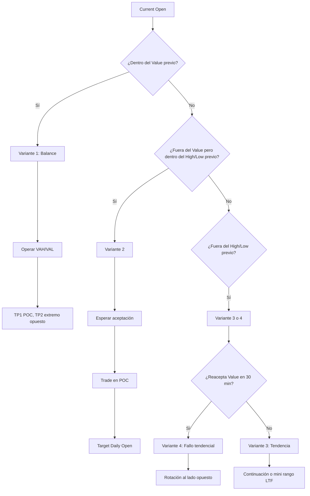

---

# 6. Estrategia 2: Rotación de Value Area

## 6.1 Qué es

Estrategia de rango basada en:

- Value Area High;
- Value Area Low;
- Point of Control.

La lógica es simple: si el mercado está balanceado, se compra barato y se vende caro dentro del área de valor. Qué concepto tan difícil, comprar abajo y vender arriba. Casi ofensivo para la industria de cursos.

## 6.2 Contexto requerido

```yaml
context_gates:
  market_regime: balance
  profile_overlap: true
  no_clear_trend_expansion: true
```

---

## 6.3 Setup 2A: Long desde VAL

### Gates

```yaml
zone_gate:
  price_near: VAL
  deviation_below_VAL: true
  reclaim_VAL: true

trigger_gate:
  one_of:
    - sell_absorption
    - negative_delta_failed
    - cvd_divergence_bullish
    - footprint_reversal_bullish
```

### Entrada

```yaml
entry:
  type: long
  methods:
    - close_back_inside_value
    - retest_VAL_after_reclaim
```

### Stop

```yaml
stop:
  level: below_deviation_low
```

### Targets

```yaml
targets:
  tp1: POC
  tp2: VAH
```

---

## 6.4 Setup 2B: Short desde VAH

### Gates

```yaml
zone_gate:
  price_near: VAH
  deviation_above_VAH: true
  reclaim_below_VAH: true

trigger_gate:
  one_of:
    - buy_absorption
    - positive_delta_failed
    - big_buy_trades_trapped
    - footprint_reversal_bearish
```

### Entrada

```yaml
entry:
  type: short
  methods:
    - close_back_inside_value
    - retest_VAH_after_reclaim
```

### Stop

```yaml
stop:
  level: above_deviation_high
```

### Targets

```yaml
targets:
  tp1: POC
  tp2: VAL
```

---

## 6.5 Diagrama

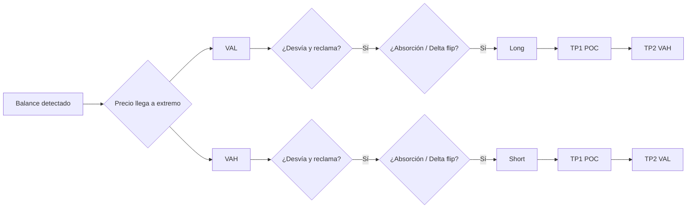

---

# 7. Estrategia 3: Continuación por LVN / Volume Gaps

## 7.1 Qué es

Estrategia de continuación usando zonas de bajo volumen dentro de una pierna impulsiva.

## 7.2 Contexto requerido

```yaml
context_gates:
  market_regime: trend
  bias_aligned: true
  impulse_leg_detected: true
```

---

## 7.3 Setup 3A: Pullback a LVN en tendencia alcista

### Gates

```yaml
zone_gate:
  anchored_volume_profile: impulse_leg
  price_near: LVN
  pullback_depth_valid: true

trigger_gate:
  one_of:
    - sell_absorption
    - positive_delta_flip
    - bullish_volume_candle_reclaim
    - big_buy_trade_well_positioned
```

### Entrada

```yaml
entry:
  type: long
  methods:
    - reclaim_LVN
    - retest_LVN
```

### Stop y targets

```yaml
stop:
  level: below_LVN_or_local_swing

targets:
  tp1: local_high
  tp2: next_balance_or_naked_poc
```

---

## 7.4 Setup 3B: Pullback a LVN en tendencia bajista

```yaml
context_gates:
  market_regime: trend_down
  bias: short

zone_gate:
  price_pulls_back_to_LVN: true

trigger_gate:
  one_of:
    - buy_absorption
    - negative_delta_flip
    - bearish_rejection
    - big_sell_trade_well_positioned

entry:
  type: short
  methods:
    - rejection_from_LVN
    - retest_failed

stop:
  level: above_LVN_or_local_swing

targets:
  tp1: local_low
  tp2: lower_balance_or_naked_poc
```

---

## 7.5 Diagrama

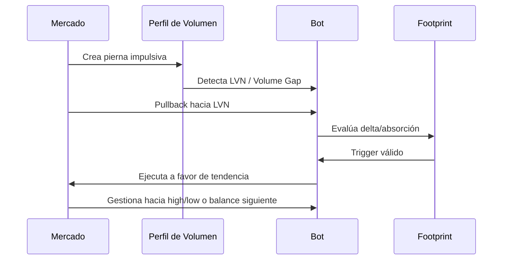

---

# 8. Estrategia 4: Delta Ranges

## 8.1 Qué es

Estrategia de rangos basada en:

- volumen;
- delta;
- CVD;
- open interest;
- absorción en extremos.

## 8.2 Datos necesarios

```yaml
inputs:
  range_high: float
  range_low: float
  range_mid: float
  range_poc: float
  delta_at_high: float
  delta_at_low: float
  cvd_slope: float
  oi_change: float | null
```

---

## 8.3 Setup 4A: Ping-pong de rango

### Long en parte baja

```yaml
context_gates:
  market_regime: balance

zone_gate:
  price_near: range_low

trigger_gate:
  conditions:
    - volume_expansion_at_low
    - negative_delta_failed
    - close_back_inside_range
  optional:
    - cvd_bullish_divergence
    - open_interest_liquidation
```

### Acción

```yaml
entry:
  type: long
  method: range_low_reclaim

stop:
  level: below_range_low_deviation

targets:
  tp1: range_poc_or_mid
  tp2: range_high
```

---

### Short en parte alta

```yaml
context_gates:
  market_regime: balance

zone_gate:
  price_near: range_high

trigger_gate:
  conditions:
    - volume_expansion_at_high
    - positive_delta_failed
    - close_back_inside_range
  optional:
    - cvd_bearish_divergence
    - big_buy_trades_trapped

entry:
  type: short
  method: range_high_reclaim

stop:
  level: above_range_high_deviation

targets:
  tp1: range_poc_or_mid
  tp2: range_low
```

---

## 8.4 Setup 4B: Fakeout de rango

```yaml
setup_id: DELTA_RANGE_FAKEOUT

conditions:
  - price_breaks_range_extreme
  - volume_does_not_expand_enough
  - delta_does_not_confirm_breakout
  - price_closes_back_inside_range

action:
  trade_direction: opposite_breakout
```

---

## 8.5 Setup 4C: Breakout real

```yaml
setup_id: DELTA_RANGE_BREAKOUT

conditions:
  - price_breaks_range_extreme
  - volume_expands
  - delta_expands_in_breakout_direction
  - open_interest_supports_new_positions
  - no_absorption_against_breakout

action:
  trade_direction: breakout_direction
  entry_method: breakout_retest_or_continuation
```

---

## 8.6 Diagrama

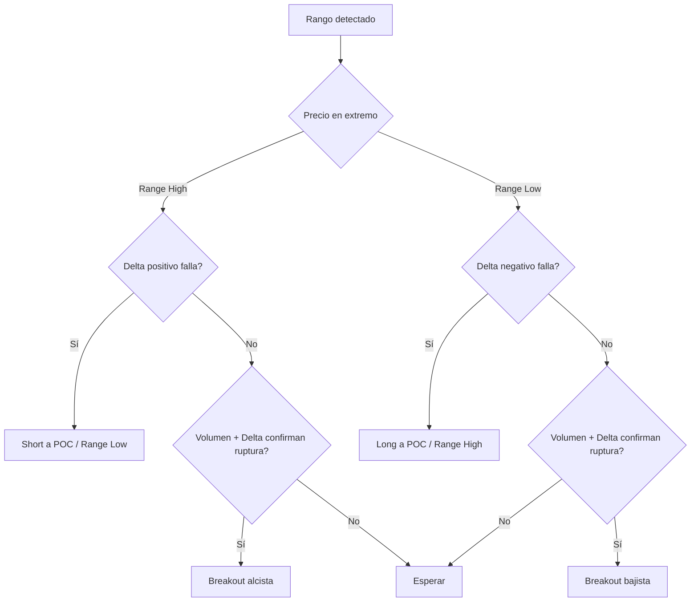

---

# 9. Estrategia 5: Absorción / Traders Atrapados

## 9.1 Qué es

Setup donde participantes entran agresivamente en una dirección, pero el precio no confirma. Quedan atrapados y el mercado gira contra ellos.

## 9.2 Setup 5A: Long por shorts atrapados

```yaml
setup_id: ABSORPTION_LONG

context_gate:
  price_in_valid_zone: true

zone_types:
  - VAL
  - naked_poc
  - order_block
  - range_low
  - support_htf
  - bwap_lower_band
  - previous_value_level

flow_gates:
  - strong_negative_delta_at_zone
  - volume_or_poc_in_lower_wick
  - candle_closes_above_aggressive_sell_area
  - next_candle_delta_positive_or_reclaim

entry:
  aggressive: retest_absorbed_poc
  conservative: close_confirmation_after_delta_flip

stop:
  level: below_absorption_low

targets:
  - nearest_liquidity
  - POC
  - VAH
  - BWAP
  - naked_poc
```

---

## 9.3 Setup 5B: Short por longs atrapados

```yaml
setup_id: ABSORPTION_SHORT

context_gate:
  price_in_valid_zone: true

zone_types:
  - VAH
  - naked_poc
  - order_block
  - range_high
  - resistance_htf
  - bwap_upper_band
  - previous_value_level

flow_gates:
  - strong_positive_delta_at_zone
  - volume_or_poc_in_upper_wick
  - candle_closes_below_aggressive_buy_area
  - next_candle_delta_negative_or_rejection

entry:
  aggressive: retest_absorbed_poc
  conservative: close_confirmation_after_delta_flip

stop:
  level: above_absorption_high

targets:
  - nearest_liquidity
  - POC
  - VAL
  - BWAP
  - naked_poc
```

---

## 9.4 Setup 5C: Drenaje de delta

```yaml
setup_id: DELTA_DRAIN_REVERSAL

long_conditions:
  - price_falls_into_valid_zone
  - negative_delta_was_increasing
  - negative_delta_stops_increasing
  - positive_delta_appears
  - price_reclaims_zone

short_conditions:
  - price_rises_into_valid_zone
  - positive_delta_was_increasing
  - positive_delta_stops_increasing
  - negative_delta_appears
  - price_rejects_zone
```

---

## 9.5 Diagrama de absorción

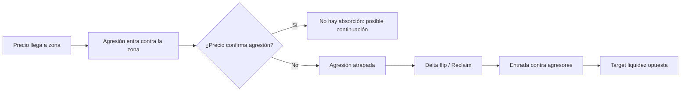

---

# 10. Estrategia 6: Liquidaciones + Naked POC

## 10.1 Qué es

Estrategia muy útil en cripto. Combina:

```text
liquidaciones + barrida + Naked POC + traders atrapados + reclaim
```

## 10.2 Setup 6A: Long en Naked POC tras liquidaciones

```yaml
setup_id: LIQUIDATION_NAKED_POC_LONG

context_gates:
  - price_rotates_toward_naked_poc
  - sell_side_liquidity_pending
  - higher_timeframe_profile_supports_rotation

zone_gate:
  - price_touches_naked_poc
  - price_sweeps_local_low

liquidation_gate:
  - liquidation_size_relative_to_recent >= threshold

flow_gates:
  - strong_negative_delta_on_breakdown
  - volume_expansion_on_deviation
  - negative_delta_absorbed
  - price_reclaims_naked_poc_or_range
  - delta_flips_positive

entry:
  type: long
  methods:
    - reclaim_naked_poc
    - bullish_engulfing_after_liquidation
    - reclaimed_order_block

stop:
  level: below_liquidation_low

targets:
  tp1: mid_range_or_0_5
  tp2: opposite_value_area
  tp3: external_liquidity
```

---

## 10.3 Setup 6B: Short en Naked POC tras liquidaciones superiores

```yaml
setup_id: LIQUIDATION_NAKED_POC_SHORT

context_gates:
  - price_rotates_toward_naked_poc
  - buy_side_liquidity_pending

zone_gate:
  - price_touches_naked_poc
  - price_sweeps_local_high

liquidation_gate:
  - liquidation_size_relative_to_recent >= threshold

flow_gates:
  - strong_positive_delta_on_breakout
  - volume_expansion_on_deviation
  - positive_delta_absorbed
  - price_reclaims_below_naked_poc_or_range
  - delta_flips_negative

entry:
  type: short
  methods:
    - reclaim_below_naked_poc
    - bearish_engulfing_after_liquidation
    - reclaimed_order_block

stop:
  level: above_liquidation_high

targets:
  tp1: mid_range_or_0_5
  tp2: opposite_value_area
  tp3: external_liquidity
```

---

## 10.4 Diagrama

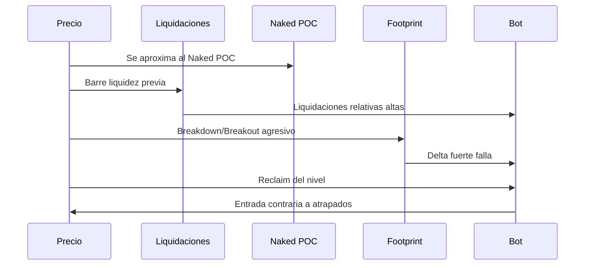

---

# 11. Estrategia 7: Big Trades

## 11.1 Qué es

Big Trades detecta grandes órdenes ejecutadas. No son automáticamente instituciones. La clave es **locación**.

## 11.2 Regla madre

```text
Big Trade en mal lugar + cierre en contra = atrapados.
Big Trade en zona lógica + precio acompaña = posible institucional bien posicionado.
```

---

## 11.3 Setup 7A: Big Trades atrapados en extremo

### Short

```yaml
setup_id: BIG_TRADES_TRAPPED_LONGS_SHORT

context_gates:
  - price_takes_buy_side_liquidity
  - price_at_resistance_or_extreme

flow_gates:
  - big_buy_trade_in_upper_wick
  - candle_closes_below_big_trade_zone
  - local_market_structure_shift_bearish

entry:
  type: short
  methods:
    - bearish_reclaim
    - pullback_to_0_5_or_0_618
    - retest_big_trade_zone

stop:
  level: above_sweep_high

targets:
  - sell_side_liquidity
  - lower_balance
  - naked_poc
```

---

### Long

```yaml
setup_id: BIG_TRADES_TRAPPED_SHORTS_LONG

context_gates:
  - price_takes_sell_side_liquidity
  - price_at_support_or_extreme

flow_gates:
  - big_sell_trade_in_lower_wick
  - candle_closes_above_big_trade_zone
  - local_market_structure_shift_bullish

entry:
  type: long
  methods:
    - bullish_reclaim
    - pullback_to_0_5_or_0_618
    - retest_big_trade_zone

stop:
  level: below_sweep_low

targets:
  - buy_side_liquidity
  - upper_balance
  - naked_poc
```

---

## 11.4 Setup 7B: Big Trades bien posicionados en retroceso

```yaml
setup_id: BIG_TRADES_CONTINUATION

context_gates:
  - market_regime: trend
  - bias_aligned: true

zone_gate:
  one_of:
    - pullback_to_0_5
    - pullback_to_0_618
    - pullback_to_LVN
    - pullback_to_OB
    - pullback_to_previous_value

flow_gate:
  - big_trade_in_trend_direction
  - delta_confirms_direction
  - price_rejects_zone

entry:
  direction: trend_direction

stop:
  level: behind_defended_zone

targets:
  - new_extreme
  - external_liquidity
  - next_balance
```

---

## 11.5 Setup 7C: Redistribución / reacumulación con Big Trades

```yaml
setup_id: BIG_TRADES_DISTRIBUTION_ACCUMULATION

context_gates:
  - mini_range_after_liquidity_event
  - prior_trapped_traders_context

flow_gates:
  - repeated_big_trades_same_side
  - cvd_or_delta_bias_in_same_direction
  - range_break_in_big_trade_direction

entry:
  type: breakout_or_retest
```

---

# 12. Estrategia 8: BWAP / VWAP + Big Trades

## 12.1 Qué es

Estrategia intradía que usa:

- BWAP/VWAP como referencia dinámica;
- rastro previo como objetivo;
- Big Trades como entrada;
- zonas altas para ventas y zonas bajas para compras.

## 12.2 Datos necesarios

```yaml
inputs:
  bwap: float
  vwap: float
  previous_bwap_upper: float
  previous_bwap_lower: float
  price_relative_to_bwap: enum[above, below, inside]
  big_trades: list[event]
  session: enum[asia, london, new_york]
```

---

## 12.3 Setup 8A: Short en zona alta con Big Trades compradores atrapados

```yaml
setup_id: BWAP_BIG_TRADES_SHORT

context_gates:
  - session == new_york
  - price_in_upper_zone
  - target_level_exists: previous_bwap_value_or_bwap

flow_gates:
  - big_buy_trades_in_upper_zone
  - price_fails_to_continue_up
  - rejection_or_delta_flip_negative

entry:
  type: short

stop:
  level: above_big_trade_zone

targets:
  tp1: midpoint_to_bwap_or_previous_trace
  tp2: bwap_or_previous_bwap_lower
```

---

## 12.4 Setup 8B: Long en zona baja con Big Trades vendedores atrapados

```yaml
setup_id: BWAP_BIG_TRADES_LONG

context_gates:
  - session == new_york
  - price_in_lower_zone
  - target_level_exists: previous_bwap_value_or_bwap

flow_gates:
  - big_sell_trades_in_lower_zone
  - price_fails_to_continue_down
  - rejection_or_delta_flip_positive

entry:
  type: long

stop:
  level: below_big_trade_zone

targets:
  tp1: midpoint_to_bwap_or_previous_trace
  tp2: bwap_or_previous_bwap_upper
```

---

## 12.5 Diagrama

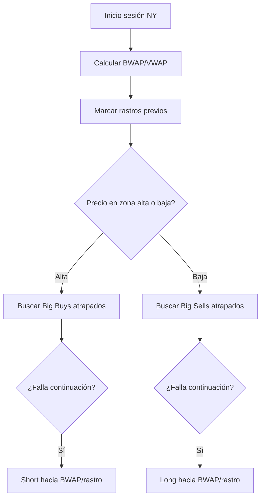

---

# 13. Estrategia 9: Order Block + Order Flow

## 13.1 Qué es

SMC/ICT filtrado con volumen real.

Un order block no es válido solo porque sea una vela bonita antes de un impulso. Debe haber evidencia de órdenes relevantes, traders atrapados o iniciativa dentro del bloque.

## 13.2 Condiciones técnicas del OB

```yaml
order_block_gates:
  - forms_swing_high_or_low
  - located_at_htf_support_or_resistance
  - close_confirms_50_percent_OB
  - market_structure_shift
  - impulse_with_imbalance
  - optional_OTE_or_618_confluence
  - volume_inside_OB_above_threshold
```

---

## 13.3 Setup 9A: Bullish OB validado

```yaml
setup_id: BULLISH_OB_ORDERFLOW

zone_definition:
  type: bullish_order_block
  description: last_bearish_candle_before_bullish_impulse

context_gates:
  - swing_low == true
  - htf_support == true
  - close_above_50_OB == true
  - bullish_market_structure_shift == true

flow_gates:
  - volume_inside_OB >= threshold
  - shorts_trapped OR buy_initiative
  - retest_shows_absorption_or_delta_flip

entry:
  type: long
  method: retest_OB_after_confirmation

stop:
  level: below_OB

targets:
  - buy_side_liquidity
  - FVG
  - VAH
  - naked_poc
```

---

## 13.4 Setup 9B: Bearish OB validado

```yaml
setup_id: BEARISH_OB_ORDERFLOW

zone_definition:
  type: bearish_order_block
  description: last_bullish_candle_before_bearish_impulse

context_gates:
  - swing_high == true
  - htf_resistance == true
  - close_below_50_OB == true
  - bearish_market_structure_shift == true

flow_gates:
  - volume_inside_OB >= threshold
  - longs_trapped OR sell_initiative
  - retest_shows_absorption_or_delta_flip

entry:
  type: short
  method: retest_OB_after_confirmation

stop:
  level: above_OB

targets:
  - sell_side_liquidity
  - FVG
  - VAL
  - naked_poc
```

---

## 13.5 Red flag crítica

```yaml
reject_order_block_if:
  - volume_inside_OB < minimum_relative_volume
  - no_reaction_on_retest
  - price_closes_through_OB_with_strong_delta
```

Un OB técnicamente perfecto pero sin volumen real es teatro. Y el mercado no paga por actuación dramática.

---

# 14. Estrategia 10: Oro / Swing con OTE + Naked POC + Cluster

## 14.1 Qué es

Estrategia especializada para oro y swing/day trading usando:

- Naked POC;
- clusters de volumen;
- OTE 70-80%;
- zonas HTF;
- absorción;
- cambio flexible de bias.

## 14.2 Setup 10A: Long en Naked POC / Cluster + OTE

```yaml
setup_id: GOLD_OTE_CLUSTER_LONG

context_gates:
  - price_at_htf_support_or_naked_poc
  - fibonacci_retracement_between_0_70_and_0_80
  - cluster_zone_present

flow_gates:
  - sellers_overpopulate
  - negative_delta_extreme
  - price_fails_to_continue_down
  - delta_flip_or_reclaim

entry:
  type: long
  method: reclaim_or_retest

stop:
  level: below_cluster_or_swing_low

targets:
  - next_naked_poc
  - htf_resistance
  - external_liquidity
```

---

## 14.3 Setup 10B: Short en Naked POC / Cluster + OTE

```yaml
setup_id: GOLD_OTE_CLUSTER_SHORT

context_gates:
  - price_at_htf_resistance_or_naked_poc
  - fibonacci_retracement_between_0_70_and_0_80
  - cluster_zone_present

flow_gates:
  - buyers_overpopulate
  - positive_delta_extreme
  - price_fails_to_continue_up
  - delta_flip_or_rejection

entry:
  type: short
  method: rejection_or_retest

stop:
  level: above_cluster_or_swing_high

targets:
  - next_naked_poc
  - htf_support
  - external_liquidity
```

---

## 14.4 Regla particular del oro

```text
En oro, los FVGs no deben priorizarse como zonas principales.
El oro tiende a consumir imbalances y moverse de punta a punta.
Priorizar Naked POC, clusters, OTE y niveles HTF.
```

---

# 15. Módulos transversales

Estos módulos no son estrategias completas. Son piezas que se insertan dentro de otras.

---

## 15.1 Velas de volumen / Trend Reverse

### Función

Confirmar que un movimiento ocurrió por volumen real, no solo por paso del tiempo.

### Uso

```yaml
volume_candle_module:
  if_time_signal_exists_and_volume_candle_confirms:
    entry_quality += 1

  if_volume_candle_confirms_before_time_structure:
    allow_early_entry = true
```

### Configuraciones mencionadas

```yaml
crypto:
  early: "44/26"
  slower_confirmation: "96/64"

indices:
  sensitive: "3/1"
```

---

## 15.2 Delta Flip

```yaml
delta_flip_bullish:
  previous_delta < 0
  current_delta > 0
  price_reclaims_level: true

delta_flip_bearish:
  previous_delta > 0
  current_delta < 0
  price_rejects_level: true
```

---

## 15.3 Delta Drain

```yaml
delta_drain:
  direction: bullish_or_bearish
  prior_delta_expansion: true
  current_delta_weaker_than_previous: true
  price_at_valid_zone: true
```

---

## 15.4 Unfinished Auction / Unfinished Action

```yaml
unfinished_auction_filter:
  if_unfinished_extreme_nearby_and_against_trade:
    reject_trade: true
```

---

## 15.5 Heatmap / Liquidez

```yaml
heatmap_module:
  detect_liquidity_pools:
    - visible_highs_lows
    - book_liquidity_clusters
    - resting_orders

  use_as:
    - target
    - zone
    - invalidation_reference
```

---

# 16. Cómo se complementan las estrategias

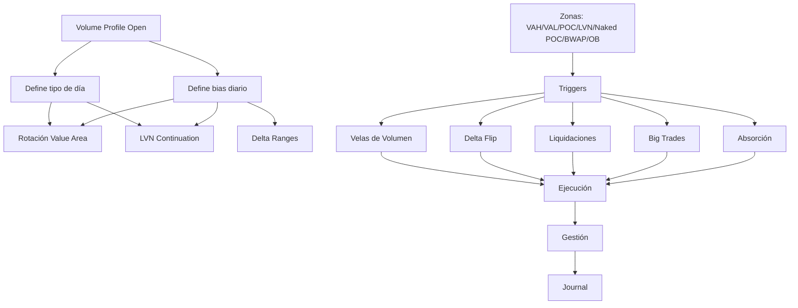

## Lectura

- **Volume Profile Open** decide el tipo de día.
- **Value Area Rotation** opera rangos.
- **LVN Continuation** opera tendencias.
- **Delta Ranges** filtra rangos, fakeouts y rupturas.
- **Absorción** dispara entradas.
- **Big Trades** confirma atrapados o continuación.
- **Liquidaciones** especializa reversals en cripto.
- **BWAP/VWAP** da targets dinámicos.
- **Order Blocks** da zonas SMC, pero filtradas por volumen.
- **Velas de volumen** agregan confirmación.

---

# 17. Matriz de compatibilidad

| Estrategia | Mejor régimen | Mejor mercado | Trigger ideal | Complemento principal | Rol algorítmico |
|---|---|---|---|---|---|
| Volume Profile Open | Rango/tendencia | Futuros, índices, oro | Footprint reversal | Absorción / Big Trades | Contexto + setup |
| Rotación Value Area | Balance | Todos | Reclaim + absorción | Delta Ranges | Setup base |
| LVN / Volume Gap | Tendencia | ES/NQ, futuros | Rechazo + delta flip | VPO Variante 3 | Setup base |
| Delta Ranges | Rango | Cripto, índices | Absorción / delta extremo | CVD / OI | Setup + filtro |
| Absorción | Reversal en zona | Todos | Delta atrapado | Cualquier zona objetiva | Trigger transversal |
| Liquidaciones + Naked POC | Reversal | Cripto | Liquidaciones + reclaim | Open Interest | Setup especializado |
| Big Trades | Reversal/continuación | Cripto, futuros | Locación lógica | Absorción / estructura | Trigger / filtro |
| BWAP + Big Trades | Intradía | SP500, índices | Big Trade atrapado | Rastro BWAP | Setup intradía |
| OB + Order Flow | Pullback/reversal | Todos | Volumen dentro del OB | SMC + delta | Zona + setup |
| Oro OTE + Naked POC | Swing/day trade | Oro | Cluster + OTE + absorción | Naked POC | Setup especializado |

---

# 18. Arquitectura algorítmica recomendada

## 18.1 Estructura de alto nivel

```python
def trading_engine(data):
    if not market_allowed(data.market):
        return NO_TRADE

    if not session_allowed(data.timestamp):
        return NO_TRADE

    context = build_context(data)
    regime = detect_regime(data, context)
    bias = detect_bias(data, context, regime)
    zones = build_zones(data, context, regime, bias)

    for zone in zones:
        if not price_in_zone(data.price, zone):
            continue

        trigger = detect_trigger(data, zone, regime, bias)
        red_flags = detect_red_flags(data, zone, regime, bias)

        if not trigger:
            continue

        if red_flags:
            continue

        trade_plan = build_trade_plan(data, zone, trigger, bias)

        if not risk_valid(trade_plan):
            continue

        return execute(trade_plan)

    return NO_TRADE
```

---

## 18.2 Priorización de señales

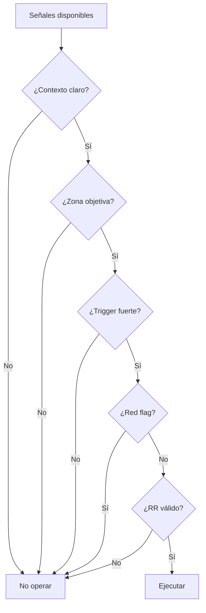

---

# 19. Esquema de datos mínimo

## 19.1 Candle data

```yaml
candle:
  timestamp: datetime
  timeframe: string
  open: float
  high: float
  low: float
  close: float
  volume: float
  delta: float
  max_delta: float
  min_delta: float
  cvd: float
  poc_price: float
  value_area_high: float | null
  value_area_low: float | null
```

## 19.2 Footprint data

```yaml
footprint:
  price_levels:
    - price: float
      bid_volume: float
      ask_volume: float
      delta: float
      total_volume: float
      imbalance_bid: bool
      imbalance_ask: bool
```

## 19.3 Big trade event

```yaml
big_trade:
  timestamp: datetime
  price: float
  side: buy | sell
  size: float
  candle_id: string
  location:
    in_wick: bool
    in_body: bool
    near_zone: bool
```

## 19.4 Liquidation event

```yaml
liquidation:
  timestamp: datetime
  price: float
  side: long_liquidation | short_liquidation
  size: float
  relative_size: float
```

## 19.5 Zone

```yaml
zone:
  id: string
  type:
    - VAH
    - VAL
    - POC
    - NakedPOC
    - LVN
    - HVN
    - BWAP
    - OrderBlock
    - OTE
    - RangeHigh
    - RangeLow
  upper: float
  lower: float
  strength_score: float
  source_timeframe: string
```

---

# 20. Especificación tipo YAML por setup

## 20.1 Ejemplo completo: Variante 4 short

```yaml
strategy: Volume Profile Open
setup_id: VP_OPEN_V4_REACCEPTANCE_SHORT
market: futures
timeframe_context: M30
timeframe_execution: M1/M5

context_gates:
  - current_open > previous_day_high
  - current_open > previous_day_vah
  - price_reenters_previous_value_area == true
  - time_inside_value_area >= 30min

zone_gates:
  - price_retests_previous_vah
  - distance_to_previous_vah <= tolerance_ticks

trigger_gates:
  one_of:
    - absorption_buyers_trapped == true
    - delta_flip_negative == true
    - big_buy_trade_failed == true
    - footprint_reversal_bearish == true

red_flags:
  reject_if:
    - strong_positive_delta_close_above_vah == true
    - breakout_volume_expansion_up == true
    - no_rejection_after_retest == true

entry:
  type: short
  method: market_or_limit_on_retest

stop:
  type: structural
  level: above_retest_high

targets:
  - previous_day_poc
  - previous_day_val
```

---

## 20.2 Ejemplo completo: Absorción long

```yaml
strategy: Absorption / Trapped Traders
setup_id: ABS_LONG_VAL_RECLAIM
market: any
timeframe_context: M30
timeframe_execution: M1/M5

context_gates:
  - market_regime == balance
  - price_near_previous_val == true

zone_gates:
  - price_deviates_below_val == true
  - price_closes_back_above_val == true

flow_gates:
  all:
    - negative_delta_at_low >= delta_threshold
    - candle_poc_in_lower_wick == true
    - close_above_absorbed_volume == true
  one_of:
    - next_candle_delta_positive == true
    - bullish_volume_candle_reclaim == true
    - cvd_bullish_divergence == true

red_flags:
  reject_if:
    - close_below_val_with_strong_negative_delta == true
    - unfinished_auction_below == true
    - breakout_volume_down == true

entry:
  type: long
  aggressive: retest_absorbed_poc
  conservative: confirmation_close

stop:
  level: below_absorption_low

targets:
  tp1: previous_poc
  tp2: previous_vah
```

---

# 21. Lo que falta en los documentos para automatizar

Los documentos dan la lógica, pero no dan todo lo necesario para automatizar. Esto no es crítica: es normal. Una clase enseña criterio; un bot necesita parámetros. Los bots no tienen criterio. Tampoco algunos humanos, pero ese es otro drama.

## 21.1 Umbrales cuantitativos

Falta definir:

```text
delta fuerte = ¿cuánto?
volumen alto = ¿cuánto?
Big Trade relevante = ¿cuánto por activo?
liquidación grande = ¿cuánto?
absorción válida = ¿qué porcentaje del delta falló?
reclaim válido = ¿cierre, wick, ticks?
aceptación = ¿cuántas velas o minutos?
```

## 21.2 Gestión de riesgo

Falta:

```text
risk_per_trade
max_daily_loss
max_weekly_loss
max_trades_per_session
cooldown_after_loss
position_sizing
partial_exit_rules
stop_to_breakeven
trailing_logic
```

## 21.3 Costes reales

Falta modelar:

```text
comisiones
slippage
latencia
spread
rollover de futuros
horarios exactos por contrato
impacto de noticias
liquidez por sesión
```

## 21.4 Resolución de conflictos

Ejemplo:

```text
Volume Profile dice long.
Delta Range dice short.
Big Trade confirma short.
Bias semanal es long.
```

Necesitas prioridad de señales:

```yaml
signal_priority:
  1: risk_filters
  2: higher_timeframe_context
  3: session_profile_context
  4: zone_quality
  5: trigger_quality
  6: execution_quality
```

## 21.5 Backtesting formal

Falta:

```text
muestra histórica mínima
walk-forward
out-of-sample
Monte Carlo
regime segmentation
metrics por setup
control de sobreoptimización
```

---

# 22. Plan de implementación por fases

## Fase 1: Base de datos y motor común

```text
- Ingesta de datos OHLCV
- Delta
- CVD
- Footprint por nivel
- Big Trades
- Liquidaciones, si aplica
- Perfiles de volumen
- Sesiones
- Journal automático
```

## Fase 2: Contexto

```text
- Detector de régimen: balance/tendencia
- Perfil diario/semanal/mensual
- Volume Profile Open
- Market structure
```

## Fase 3: Zonas

```text
- VAH / VAL / POC
- Naked POC
- LVN / HVN
- BWAP / VWAP
- Order Blocks
- OTE
```

## Fase 4: Triggers

```text
- Absorción
- Delta flip
- Delta drain
- Big Trades atrapados
- Liquidaciones
- Velas de volumen
```

## Fase 5: Estrategias iniciales

Empezar con:

```text
1. Volume Profile Open
2. Rotación Value Area + Absorción
3. LVN Continuation
```

No empezar con las 10. Eso sería construir un cohete con manual de licuadora.

## Fase 6: Especialización

```text
- Delta Ranges
- BWAP / VWAP + Big Trades
- Liquidaciones cripto
- Order Block + Order Flow
- Oro OTE + Naked POC
```

---

# 23. Plan de backtesting

## 23.1 Mínimo por setup

Cada setup debe evaluarse de forma aislada:

```yaml
backtest_unit:
  strategy_id: string
  setup_id: string
  market: string
  timeframe_context: string
  timeframe_execution: string
  session: string
  sample_size_minimum: 100_trades
```

## 23.2 Métricas básicas

```text
win_rate
profit_factor
expectancy
average_R
max_drawdown
max_consecutive_losses
avg_trade_duration
slippage_sensitivity
commission_sensitivity
setup_frequency
```

## 23.3 Segmentación

```text
Por mercado:
  ES, NQ, GC, BTC, ETH

Por sesión:
  Asia, Londres, Nueva York

Por régimen:
  balance, tendencia alcista, tendencia bajista

Por volatilidad:
  baja, media, alta

Por noticias:
  con noticias, sin noticias
```

## 23.4 Walk-forward

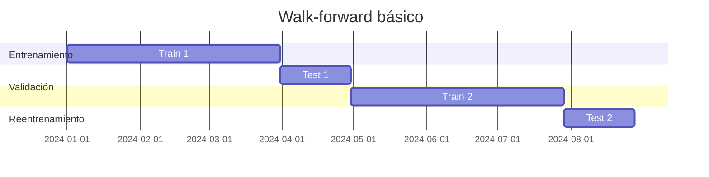

---

# 24. Métricas por setup

| Setup | Métrica clave | Riesgo principal | Qué validar |
|---|---|---|---|
| VP Open V1 | Rotación a POC | Día rompe rango | Aceptación real dentro de value |
| VP Open V3 | Continuación | Pullback profundo | Distancia al value y fuerza de tendencia |
| Value Rotation | Win rate y MFE | Chop excesivo | Reclaim válido |
| LVN Continuation | RR | Rango disfrazado de tendencia | Régimen tendencial |
| Delta Range Fakeout | Reversal speed | Breakout real | Delta/volumen no confirman |
| Absorción | Calidad de trigger | Continuación contra entrada | Cierre contra agresión |
| Liquidaciones + NPOC | Velocidad de reversal | Knife catching | Reclaim y delta flip |
| Big Trades | Locación | Interpretar todo como institucional | Cierre posterior al Big Trade |
| BWAP + Big Trades | Target hit rate | Sesión lateral | Distancia a BWAP/rastro |
| OB + Flow | Win rate en retest | OB débil | Volumen dentro del bloque |
| Oro OTE Cluster | RR swing | Volatilidad/noticias | Cluster + OTE + reacción |

---

# 25. Conclusión operativa

De los documentos salen **10 familias estratégicas**, pero el diseño algorítmico no debe tratarlas como recetas sueltas.

La estructura correcta es:

```text
strategy_id
context_gate
zone_gate
trigger_gate
red_flag_gate
risk_gate
entry_logic
exit_logic
journal
```

Lo que sí está suficientemente presente en los documentos:

```text
- lógica conceptual
- zonas operativas
- setups principales
- triggers de order flow
- formas de complementar
- red flags cualitativas
```

Lo que no está suficientemente definido:

```text
- umbrales numéricos
- prioridades entre señales
- gestión de riesgo exacta
- backtesting formal
- parámetros por activo
- modelo de ejecución
```

## Orden recomendado

```text
1. Construir motor común
2. Programar Volume Profile Open
3. Programar Value Area Rotation + Absorción
4. Añadir LVN Continuation
5. Añadir Big Trades como trigger
6. Añadir Delta Ranges
7. Añadir BWAP/VWAP
8. Especializar cripto y oro
```

La meta no es que el bot “piense”. La meta es que el bot **obedezca reglas limpias**. Si después quieres meter un LLM para razonamiento contextual, eso puede ir como capa superior, pero no debe decidir entradas sin gates duros. Un LLM opinando sobre una entrada sin constraints es básicamente un trader con traje de API.

---

# 26. Fuentes externas verificadas

Estas fuentes externas se usaron solo para reforzar contexto técnico y riesgo operativo, no para sustituir los documentos compartidos:

1. **CME Group - Performance Bonds / Margins**  
   https://www.cmegroup.com/solutions/risk-management/performance-bonds-margins.html

2. **CME Group - Product Margins**  
   https://www.cmegroup.com/solutions/risk-management/margin-services/product-margins.html

3. **ATAS - Professional Order Flow & Volume Analysis Software**  
   https://atas.net/

4. **ATAS - How Footprint Charts Work**  
   https://atas.net/blog/how-footprint-charts-work-footprint-modes-and-what-they-are-for/

---

## Apéndice A: Convención de nombres recomendada

```yaml
naming_convention:
  strategy:
    - VP_OPEN
    - VALUE_ROTATION
    - LVN_CONTINUATION
    - DELTA_RANGE
    - ABSORPTION
    - LIQUIDATION_NPOC
    - BIG_TRADES
    - BWAP_BIG_TRADES
    - OB_FLOW
    - GOLD_OTE_CLUSTER

  direction:
    - LONG
    - SHORT

  variant:
    - V1
    - V2
    - V3
    - V4
    - FAKEOUT
    - BREAKOUT
    - RECLAIM
    - RETEST
```

Ejemplo:

```text
VP_OPEN_V4_REACCEPTANCE_SHORT
VALUE_ROTATION_VAL_RECLAIM_LONG
LVN_CONTINUATION_PULLBACK_SHORT
ABSORPTION_SHORTS_TRAPPED_LONG
LIQUIDATION_NPOC_RECLAIM_LONG
```

---

## Apéndice B: Regla final de diseño

```text
Un setup no existe hasta que pueda expresarse como:
IF contexto
AND zona
AND trigger
AND no red flags
AND riesgo válido
THEN operación
ELSE no operación
```

Si no puedes escribirlo así, todavía no tienes estrategia algorítmica. Tienes intuición. La intuición está bien para humanos; los bots prefieren reglas porque no tienen ansiedad ni quieren presumir capturas en Discord.
